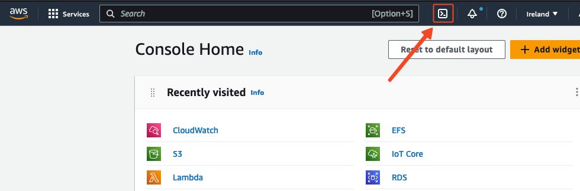
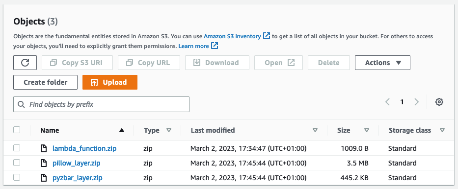
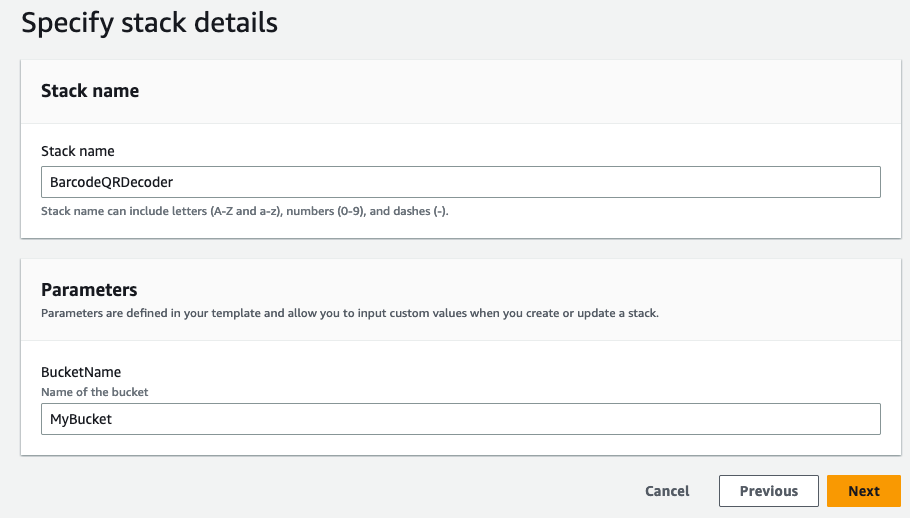
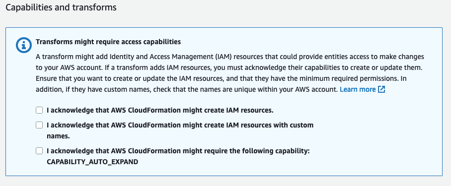
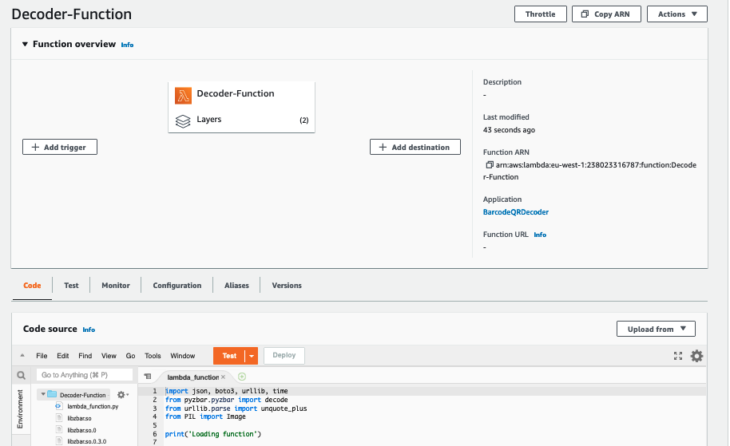
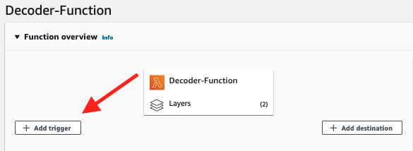
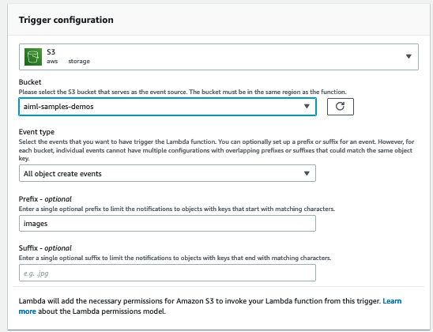
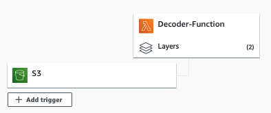
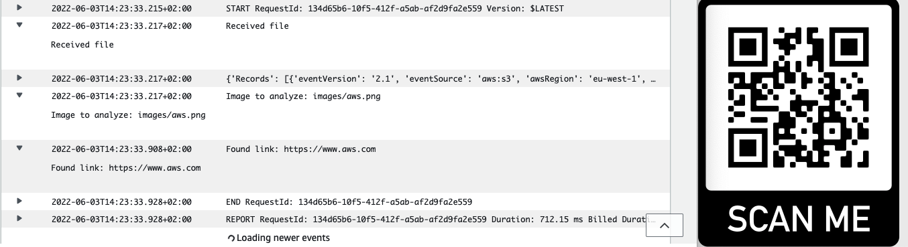

Easily decode barcodes and QR codes at scale with AWS Lambda!
With this Lambda Function you will be able to add decoding features to your applications at scale!

### What do I need?
**AWS Account** If you don't already have an account or you have not been handed one as part of a workshop, please visit the following [link](https://portal.aws.amazon.com/billing/signup?nc2=h_ct&src=header_signup&redirect_url=https%3A%2F%2Faws.amazon.com%2Fregistration-confirmation#/start)! 

### Deploying the function automatically 

#### Step 0, Prerequisites needed (IMPORTANT)
* **You will need to have an Amazon S3 Bucket created.**
* **You will need to create a folder inside that bucket, where you will upload your images to decode.(Optional)**

#### Step 1, Generate code artifacts and dependencies
* Access AWS CloudShell, a browser-based shell inside the AWS console. You can click the terminal icon next to the search bar or looking for _Cloudshell_ in the service search bar.

* Once CloudShell has initiallized, clone this repo 
   * `git clone https://github.com/aws-samples/Barcode-QR-Decoder-Lambda.git`
* Run the `setup.sh` script in order to generate the needed lambda layers and code package. You must specify the bucket where you want to upload this artifacts replacing <BUCKET_NAME> with the S3 bucket name.
   * `sh Barcode-QR-Decoder-Lambda/src/code/setup.sh -b <BUCKET_NAME>`
* Once the script finishes, you should see 3 new files in your S3 bucket under `BarcodeQRDecoder/qr-reader/assets/` path, the two Lambda layers containing the libraries needed (Pillow and Pyzbar) and the lambda code packaged in a .zip file

#### Step 1, Deploy your Lambda function
* [Launch](https://eu-west-1.console.aws.amazon.com/cloudformation/home?region=eu-west-1#/stacks/create/review?templateURL=https://aiml-samples-demos.s3.eu-west-1.amazonaws.com/qr-reader/assets/template.yaml&stackName=BarcodeQRDecoder) the following **AWS CloudFormation Template** in your account (The link will automatically open the AWS CloudFormation console). **THIS TEMPLATE IS TO BE DEPLOYED IN EU-WEST-1 REGION ONLY**
* Specify in the template parameter the same name of the S3 bucket as before 

* Check the AWS CloudFormation acknowledgements and click Create stack.

* Wait until the stack goes into the **CREATE_COMPLETE** status.

* You can now head over to the AWS Lambda service and will find your new function!

#### Step 2, Configure your Amazon S3 Trigger event
* Once you open your new Lambda Function, head over to the **Function overview** panel and click on **Add trigger**.

  

* Select **S3** from the trigger list.
* Select the S3 bucket where you will be uploading your files.
* Select **All object create events**.
* If you want to add prefix to specify a folder you can also add it.

  

* Once you have configured all parameters, **Add** the trigger. 

 

#### Step 3, Try out your Lambda Function
You are now ready to add Barcode/QR code decoding capabilities to your applications at scale!
Simply add an image with a QR to your S3 bucket folder you specified earlier. 
You can see the logs your lambda function returns in the CloudWatch Logs console.

### Deploying in Additional Regions
This example and the templates provided are to be deployed in **eu-west-1** region. If you wish to create your Lambda Function in a different region you have the function code available in the src/code folder.
You will have to create a role for the AWS Lambda function to be able to interact with the Amazon S3 service. You will also have to create and add lambda layers to load dependencies the function needs. 

**Create your Lambda Function**
* Create a new Lambda Function.
* Select Author from scratch.
* Input a new name for your function
* Select Python 3.7 as runtime
* Select x86_64 as architecture
* Create a new role with basic Lambda permissions
* Once the function has created, head over to the Code Panel.
* Select **Upload From** and choose **.zip file**.
* Upload the following lambda_function.zip file
**Create and add Lambda Layers**
* Inside the AWS Lambda service, head to Layers --> Create Layer
    * Create a new layer uploading the Pillow_Layer.zip, and select x86_64 as compatible architecture and Python 3.7 as compatible runtime.
    * Return to your function and in your layers section, select **Add Layer**
    * Select your layer which will be available at the Custom AWS layers dropdown.
* Repeat the same process for the Pyzbar Layer. 

**Enable Amazon S3 Access**
* Head over to IAM and add permissions to your associated role to access your S3 Bucket.
* You can find your role in the **Configuration->Permissions** tab in the function editor.

**Configure Amazon S3 trigger**
* Once you open your new Lambda Function, head over to the **Function overview** panel and click on **Add trigger**.
* Select **S3** from the trigger list.
* Select the S3 bucket where you will be uploading your files.
* Select **All object create events**.
* If you want to add prefix to specify a folder you can also add it.
* Once you have configured all parameters, **Add** the trigger. 
