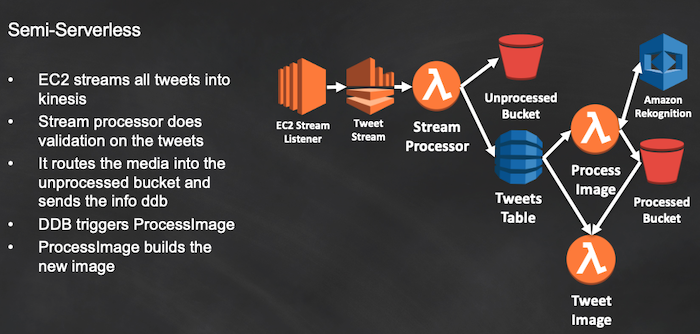

# Rekognition powered Twitter bot

In this lab you will build a twitter bot that modifies the images it receives with Amazon Rekognition to be shown like this:

The high-level steps will be:
* Setup the Twitter app
* Launch the Cloud Formation stack for the demo
* Send a test tweet
* Understand how the script works, and perform the additional exercises if desired

