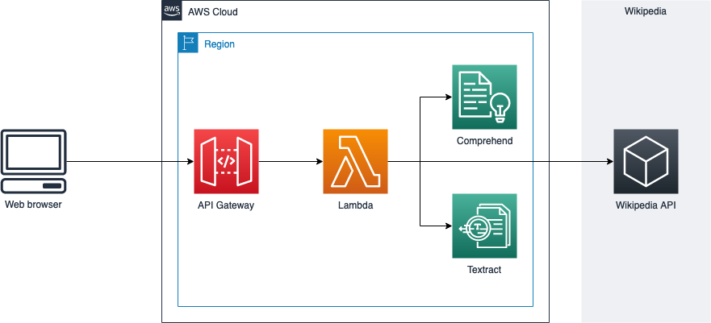
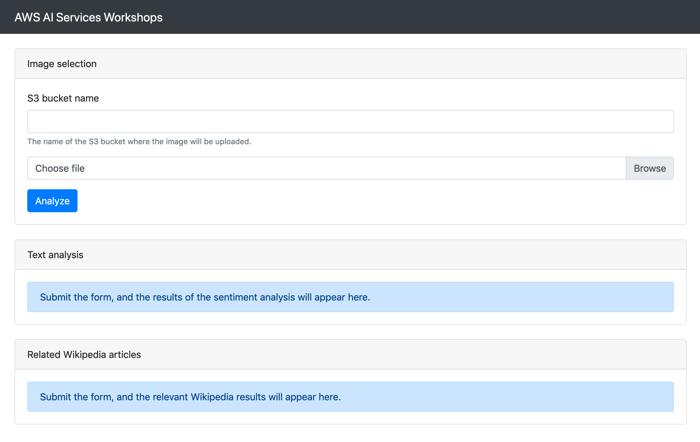
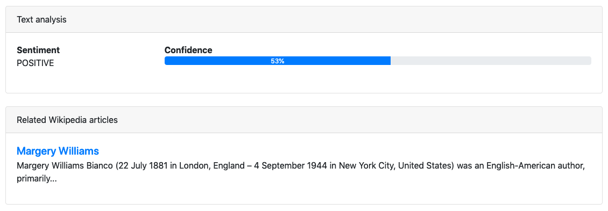

# Text analysis with Amazon Textract and Amazon Comprehend

In this lab, you will extract text from documents and analyze it to detect key entities, such as names of people or cities. Then, you will look these terms up in Wikipedia and build a list of links to the appropriate Wikipedia articles.

This is the overall architecture of the application that you will work on:



## Launch the skeleton infrastructure

We would like you to focus on working with Textract and Comprehend, so for the sake of simplicity we have already done most of the work for you. You will create all the prerequisite components using a CloudFormation stack.

1. Click the following Quick Launch button to open the CloudFormation console. All the necessary parameters will already be populated.

	[](https://eu-west-1.console.aws.amazon.com/cloudformation/home?region=eu-west-1#/stacks/create/review?templateURL=https://aimlworkshopspipeline-workshopresourcesbucket-22rpkozo2usk.s3-eu-west-1.amazonaws.com/aiml-workshops-text-analysis.template.yaml&stackName=AIWorkshopsTextAnalysis&param_ApiFunctionCodeS3Bucket=aimlworkshopspipeline-workshopresourcesbucket-22rpkozo2usk&param_ApiFunctionCodeS3Key=aiml-workshops-text-analysis-api.zip)

2. Check the **I acknowledge that AWS CloudFormation might create IAM resources** box and click **Create stack**.

3. Wait until the stack goes into the `CREATE_COMPLETE` status, then go to the **Outputs** tab.

4. You will see two outputs named **UploadBucket** and **ApiEndpoint**. Take note of both of them, as you will use them later.

Take some time to inspect the infrastructure that has been deployed on your behalf:

* An S3 bucket where users will upload documents
* An API built in API Gateway that will expose the functionality of our backend
* A Lambda function that contains the backend logic to process requests

## Download the web application

As you can see in the architecture diagram above, you will interact with the API with a web application. This application is mostly complete, but there are some pieces of code missing and we need you to fill them in!

Begin by downloading the source code from [this link](https://aimlworkshopspipeline-workshopresourcesbucket-22rpkozo2usk.s3-eu-west-1.amazonaws.com/aiml-workshops-text-analysis-www.zip). Uncompress it and open the **index.html** file in a web browser such as Chrome or Firefox. You should see something similar to this:



## Implement the document upload feature

If you fill in the form (you can use the bucket name from the CloudFormation output named **UploadBucket**) on the web application and click **Analyze**, nothing will happen. This is because the web application has not yet implemented the functionality that uploads the document selected by the user to S3. This is where you come in.

Open **script.js** with a text editor or IDE. Notice how at the top of the file, there are some empty variables declared:

```js
// The AWS API credentials needed to successfully call AWS services.
// You can create these from the IAM console.
var awsAccessKeyId = '';
var awsSecretAccessKey = '';

// The region in which to operate (eu-west-1, us-east-1, etc.).
var awsRegion = '';

// The base endpoint of your API. Set this to the appropriate value.
// (Example: https://abcd1234e5..execute-api.eu-west-1.amazonaws.com)
var apiEndpoint = '';
```

Furthermore, if you scroll down through the code you will see a couple of comments that begin with `HINT`. These comments are telling you where the missing code needs to be implemented, and give you some tips about how to complete the task.

These are the tasks that need to be completed:

1. Fill in the variables at the top of the source code, in the section labeled `Configuration`. This includes your AWS API credentials (access key and secret), the AWS region of your choice, and the API endpoint obtained from the CloudFormation output.
2. Instantiate the S3 client using the AWS SDK for JavaScript, which has been already included in the web application.
3. Fill in the blanks in the `uploadFileToS3()` function.

?> **Exercise:** complete the steps listed above.

<details>
<summary>Stuck? Click here to view the solution.</summary>

The S3 client can be initialized as follows:

```js
var s3Client = new AWS.S3(
	{
		accessKeyId: awsAccessKeyId,
		secretAccessKey: awsSecretAccessKey,
		region: awsRegion
	}
);
```

The `uploadFileToS3()` function code should look like this. Not how we are calling `upload()` on the S3 client and then either resolving or rejecting `promise` depending on the operation result:

```js
function uploadFileToS3(file, bucket) {
	var promise = new Promise((resolve, reject) => {
		var params = {Bucket: bucket, Key: file.name, Body: file};
		s3Client.upload(params, function(err, data) {
			if (err) {
				reject(err);
			} else {
				resolve(data);
			}
		});
	});
	return promise;
}
```

</details>

If you reload the web application and submit the form, the upload process should now work. You can check this by inspecting the S3 bucket using the S3 web console. However, you might have noticed that after uploading the document the web application makes HTTP requests to the API, which return an error. This is because the API also needs some work from you!

## Implementing the missing backend functionality

The API, implemented as a Lambda function, exposes the following operations:

* `POST /text_detection`, which receives a reference to a document (image or PDF) stored in S3 and returns the text that was detected on the document, using Amazon Textract behind the scenes.
* `POST /text_analysis`, which receives a block of text and returns key entities (such as names of people and locations) as well as the sentiment of the text (positive, negative or neutral), using Amazon Comprehend behind the scenes.
* `GET /wikipedia_search`, which receives a search term and returns Wikipedia articles matching that term.

Let's open the source code for the API backend:

1. Go to the AWS Lambda Management Console. You should see a list of Lambda functions.
2. Click on the function named **AIServicesWorkshop-TextAnalysis-ApiHandler**.
3. Scroll down until you see the source code.

Inspect the code. You will notice that almost all the logic is there already, but the `detect_text_in_image()` and `analyze_text()` functions are missing some code. This is what needs to be done:

1. Instantiate the Textract and Comprehend clients using the `boto3` library, so that you can call the APIs of these services.
2. Complete the `detect_text_in_image()` function to call Amazon Textract's `DetectDocumentText` action.
3. Complete the `analyze_text()` function to call Amazon Comprehend's `DetectDominantLanguage`, `DetectSentiment` and `DetectEntities` actions.

?> **Exercise:** complete the steps listed above. Again, notice how there are some code blocks with the word `HINT` that can help you with the task.

<details>
<summary>Stuck? Click here to view the solution.</summary>

As with the web client, you need to first instantiate the clients for the relevant AWS services that you will be calling afterwards. In this case, Textract and Comprehend:

```python
textract = boto3.client('textract')
comprehend = boto3.client('comprehend')
```

The `detect_text_in_image()` can be implemented as follows. Notice how we are getting only the blocks of type `LINE` and then joining them all together with newline characters (`\n`):

```python
def detect_text_in_image(bucket_name, key):
    response = textract.detect_document_text(
        Document={
            'S3Object': {
                'Bucket': bucket_name,
                'Name': key
            }
        }
    )
    blocks = filter(lambda x: x['BlockType'] == 'LINE', response['Blocks'])
    lines = map(lambda x: x['Text'], blocks)
    return "\n".join(lines)
```

Finally, the `analyze_text()` function can be implemented like this (both `detect_sentiment()` and `detect_entities()` expect a language code as a paremeter, so we call `detect_dominant_language()` first to get it):

```python
def analyze_text(text):
    response = comprehend.detect_dominant_language(
        Text=text
    )
    language = response['Languages'][0]['LanguageCode']

    response = comprehend.detect_sentiment(
        Text=text,
        LanguageCode=language
    )
    sentiment = {'Sentiment': response['Sentiment'], 'SentimentScore': response['SentimentScore']}

    response = comprehend.detect_entities(
        Text=text,
        LanguageCode=language
    )
    entities = filter(lambda x: x['Type'] not in ['DATE', 'QUANTITY'], response['Entities'])

    return {'Language': language, 'SentimentAnalysis': sentiment, 'Entities': list(entities)}
```

Click **Deploy** to begin using the new version of your Lambda function.

</details>

## Testing the whole thing

That's it! If you try the web application one more time, everything should work. Let's try it with this picture of a page of the Velveteen Rabbit:


Download it to your computer and use it to fill the form. After clicking **Analyze**, the _Text analysis_ section should show the sentiment of the text, and the _Related Wikipedia articles_ should show a link to _Margery Williams Bianco_, the author of the book and whose name appears at the top of the picture:



Congratulations! You have completed this lab.
