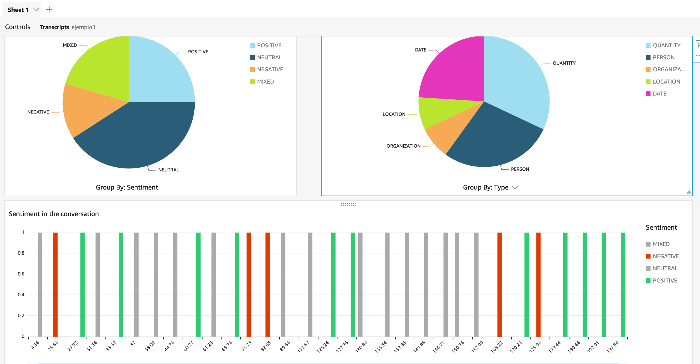

Welcome to this AWS Comprehend Calls Demo. The objective of this demo is deploy an MVP for a solution which is able to transcribe and extract insights from audio files, like contact center calls. 


### Why do I need?
  
* **AWS Account** If you don't already have an account or you have not been handed one as part of a workshop, please visit the following link! 

### What am I going to build?

As mentioned before, the objective is for you to have a demo solution to transcribe calls and extract insights from conversations. To speed the process up, you only have to deploy a CloudFormation Template, which will automatically provision the infrastructure of the solution. 

First, let's have a look at the infrastructure you are going to be able to deploy and the services you are going to use.


#### 1. Store your audios 

The first part of the process is storing your audio files in Amazon S3. Once a file arrives in S3, a Lambda Function will be executed which will trigger the process for extracting the insights from the audio. 

**IMPORTANT: Audio files must not include characters different from [A-Z],[a-z],[0-9] or [ ._ ]**

[Amazon Simple Storage Service (S3)](https://aws.amazon.com/s3/) is object storage built to store and retrieve any amount of data from anywhere on the Internet. It’s a simple storage service that offers an extremely durable, highly available, and infinitely scalable data storage infrastructure at very low costs.   

With [AWS Lambda](https://aws.amazon.com/lambda/), you can run code for virtually any type of application or backend service - all with zero administration. Just upload your code and the service takes care of everything required to run and scale your code with high availability. 


#### 2. Launch the extraction workflow

After the audio file is sent to Amazon S3, an AWS Lambda Function is triggered, which launches an AWS Step Functions Workflow. 

[AWS Step Functions](https://aws.amazon.com/step-functions/) is a fully managed service that makes it easy to coordinate the components of distributed applications and microservices using visual workflows.


The workflow goes through the following stages:

1. **Transcribe the audio file:** An AWS Lambda function will be executed, which will call the [Amazon Transcribe](https://aws.amazon.com/transcribe/) service to obtain the transcription of the audio which was uploaded to Amazon S3. 
    
    When the job ends, a JSON file with the transcription will be stored in the Amazon S3 Output bucket, in the transcriptions folder. When this stage of the workflow ends, it will call the next AWS Lambda function.

2. **Obtain insights:** Another AWS Lambda will be executed, which will call the [Amazon Comprehend](https://aws.amazon.com/comprehend/) service to extract insights from the generated transcription. The service receives the location of the transcription file, and will return the entities it detects, as well as the language and sentiment of the text.

    Once these insights are retrieved, they will be stored both in Amazon DynamoDB and Amazon S3 for further analysis and visualization. 

3. **Store results in Amazon DynamoDB:** An AWS Lambda function is triggered, which will store the transcription insights into your Amazon DynamoDB table.

    [Amazon DynamoDB](https://aws.amazon.com/dynamodb/) is a key-value and document database that delivers single-digit millisecond performance at any scale. It's a fully managed, multi-region, multi-active, durable database with built-in security, backup and restore, and in-memory caching for internet-scale applications

4. **Store results in Amazon S3:** An AWS Lambda function is triggered, which will store the transcription insights into your Amazon S3 Output bucket.

#### 3. Visualize your data

Once you have the transcriptions insights stored in Amazon S3, you can use visualization tools such as [Amazon Quicksight](https://aws.amazon.com/quicksight/) to create reports and visual representations of your data.

When importing results into Amazon Quicksight select S3 as the data source. You will have to import both conversations and entities data, and then [join](https://docs.aws.amazon.com/quicksight/latest/user/joining-data.html) the data.

Here is an example of the manifest you will have to use to each folder of data:
```
{
    "fileLocations": [
        {
            "URIPrefixes": [
                "s3://[OUTPUT_BUCKET_NAME]/transcriptions-insights/[conversations and entities]/"
            ]
        }
    ],
    "globalUploadSettings": {
        "format": "JSON"
    }
}
```




### How do I build this?

Here are the steps to deploy the AWS Infrastructure:
  * [Launch](https://eu-west-1.console.aws.amazon.com/cloudformation/home?region=eu-west-1#/stacks/create/review?templateURL=https://comprehendcallsrepo.s3-eu-west-1.amazonaws.com/template.yaml&stackName=Comprehend-Calls) the following **AWS CloudFormation Template** in your account (The link will automatically open the AWS CloudFormation console).
  * You will have to fill some parameters, make sure you insert unique names for your resources, check the AWS CloudFormation acknowledgements and click Create stack.
  * Wait until the stack goes into the **CREATE_COMPLETE** status.
  * You will see an output named **Input Bucket**. Inside this bucket is a folder named "audios", where you will store your audio files.
  

