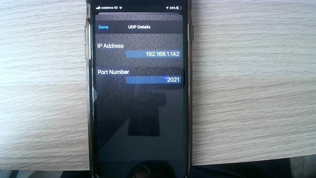

# Using your mobile phone GPS module with your Raspberry Pi 

Our Raspberry Pi device does not have a GPS module. We will use the GPS of a mobile phone and stream the location from the phone into the Raspberry Pi.

> Note In this workshop we use a WIFI connection but you may also use Bluetooth as an alternative. 

First we will install an application called **GPS2IP Lite** in our mobile phone 

https://apps.apple.com/com/app/gps2ip-lite/id1562823492

> Note You may select other equivalent applications of your preference for your Android or IOS mobile phone. 

This application allows us to access the GPS receiver in our phone and setup a destination where we want to stream the GPS coordinates.

**Setup**

The configuration is quite straight forward: 

In the application Settings, go to *Connection Method* and select **UDP Pus**" configuration.
  

  
Next, enter the IP address of your Raspberry Pi device. 

**Start Streaming GPS positions**

To start streaming the location from the mobile phone to the Raspberry Pi, make sure the option "EnableGPS2IP Lite" is enabled. 

In case you need additional help, a more detailed explanation is provided in this video: *https://www.youtube.com/watch?v=rkmQxvT8BpQ*

Please note that as part of the setup you need to have the *gpsd* daemon listening to the socket that you have configured in your GPS2IP application. 
In our case the command is >**gpsd -N udp://192.168.1.142:2021**

 