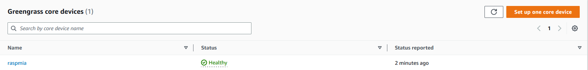
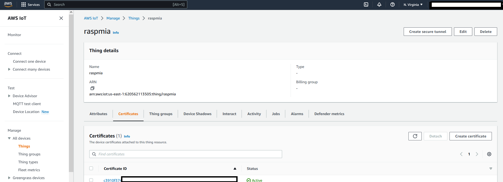

# Configure your Raspberry Pi as an IoT thing

**AWS IoT Greengrass** is an open source Internet of Things (IoT) edge runtime and cloud service that helps you build, deploy and manage IoT applications on your devices.  With AWS IoT Greengrass, you can program devices to act locally on the data they generate, run predictions based on machine learning models, and filter and aggregate device data.

We will install AWS IoT Greengrass in our Raspberry Pi device to then run the object detection machine learning model.

The step by step guide for the installation of AWS IoT Greengrass can be found at: 

https://docs.aws.amazon.com/greengrass/v2/developerguide/quick-installation.html

You need to follow the steps as indicated in the guide. 

>**About the installation process:** 

> *Please note that AWS CLI V2 isn't available for 32-bit ARM devices. We are using Raspberry Pi OS 64-bit for this demo. 
(If you have an older Raspberry Pi 32-bit device then you may need to install Greengrass v1)

> *As part of the installation process, you will register the Raspberry Pi device as an AWS IoT thing. The Raspberry Pi device will use a digital certificate to authenticate with AWS. This certificate allows the device to communicate with AWS IoT and AWS IoT Greengrass. 

When you finish the installation you should see the new Greengrass core device as shown in the picture.
From your AWS Console navigate to *AWS IoT --> Greengrass devices --> Core devices*
  

  
  

The new devide should also appear as an IoT thing in the corresponding menu
From your AWS Console navigate to *AWS IoT --> All devices --> Things*
  

  
