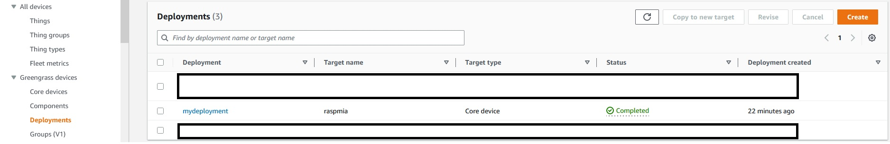
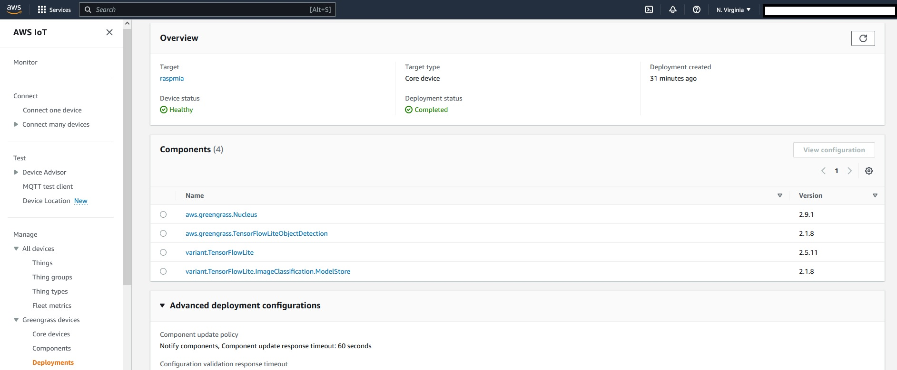
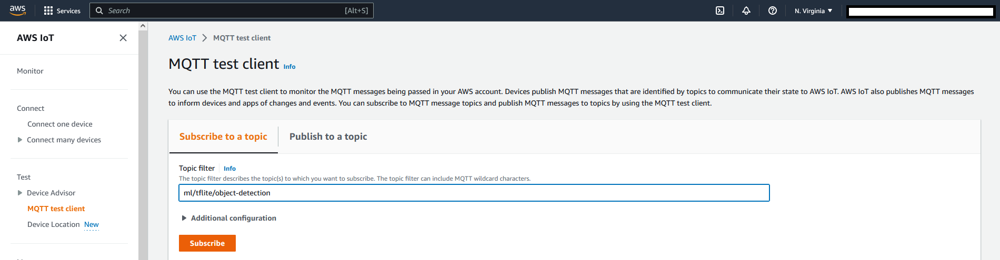

# Deploying a TensorFlow Lite object detection model 

AWS IoT Greengrass provides and maintains prebuilt components that you can deploy to your devices. This includes machine learning components that you can deploy to supported devices to perform machine learning inference using models trained in Amazon SageMaker or with your own pre-trained models that are stored in Amazon S3. 

We will use the **TensorFlow Lite object detection component** (aws.greengrass.TensorFlowLiteObjectDetection) which contains sample inference code to perform object detection inference using TensorFlow Lite (https://www.tensorflow.org/lite/guide/python) and a sample pre-trained **Single Shot Detection (SSD) MobileNet 1.0 model**. 
This component uses the **variant TensorFlow Lite object detection model store** and the **TensorFlow Lite runtime** components as dependencies to download TensorFlow Lite and the sample model. 

The step by step guide to complete the deployment can be found at: 

https://docs.aws.amazon.com/greengrass/v2/developerguide/tensorflow-lite-object-detection-component.html

Once the deployment is finished, you should see it with Status=Complete as shown in the picture below. 

  

You should see the following **components** included in the deployment: 

* *aws.greengrass.Nucleus*
* *aws.greengrass.TensorFlowLiteObjectDetection*
* *variant.TensorFlowLite*
* *variant.TensorFlowLite.ImageClassification.ModeStore*

  

**IMPORTANT:**
 The default configuration of the TensorFlow lite object detection component will make predictions taking as an input an image *objects.jpg* in the folder specified in *ImageDirectory*. The default directory is:  */greengrass/v2/packages/artifacts-unarchived/component-name/object_detection/sample_images/*

To use images from a camera connected to the Greengrass core device you need to **set** *UseCamera* **value** to *True*. 
Unfortunately our Raspberry Pi OS Bullseye includes a new camera stack that is enabled by default and isn't compatible. If you enable the legacy camera stack it will not work either - at least with the 64 bit version of the OS. 

Therefore we will create a **new version of aws.greengrass.TensorFlowLiteObjectDetection** component to overcome this incompatibility.
On the other hand, we want our Raspberry Pi to report the GPS location of the objects detected. 
We will implement this feature in our new version of the component. 

**TEST:**

Before proceding with the next step you can now test that your Raspberry Pi can detect objects from a picture. To do that, make sure that *UseCamera* is set to *false* and
that *objects.jpg* is included in the default *ImageDirectory*. Then you can use the MQQT Test client and subscribe to the default topic *ml/tflite/object-detection*

[]

You should be able to see the messages with the object detection results. 

Next we will **create our own AWS Greengrass component**.

