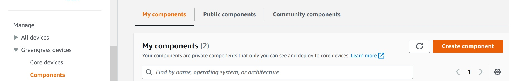
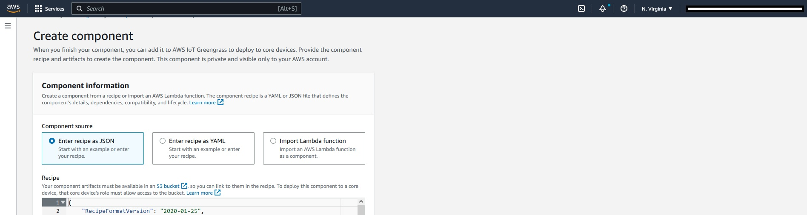
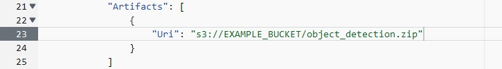

# Create a new TensorFlowLiteObjectDetection component 

We need to create a new version of the TensorFlowLiteObjectDetection for our Raspberry Pi 64-bit OS Debian with a USB camera attached. 

From the console navigate to *AWS IoT-->Manage-->Greengrass devices -->Components*
Then click on "Create component" . 

  

In the next screen we will select as Component Source "Entire recipe as JSON"

  
For the recipe, you can copy the contents of the recipe.json file available in this directory. 
You may need to change the version in the recipe file to make it unique to your component creation --> "ComponentVersion": "2.1.8",

You can provide your own name for the component in the recipe file. In the recipe provided in this workshop, we are naming our new component as *aws.greengrass.TensorFlowLiteObjectDetection.mod*

The recipe file contains an object called **Artifacts**. You should add a "Uri" to your own bucket where you have stored the compressed artifacts files: "object_detection.zip".

  

In the directory of this chapter you can find the **object_detection.zip** file that you need to store in your S3 bucket. 

The zip package includes a directory named **sample_image** (where you store the image in case you don't want to use the Camera) and a set of python files. 

We have made some changes to the original **prediction_utils.py** file so that it can run the inference from the USB camera and report the GPS positions. 
Those changes are mainly implemented in the functions *def predict_from_cam():*, *def predict(image_data):* and a new created function *def getPositionData():*

