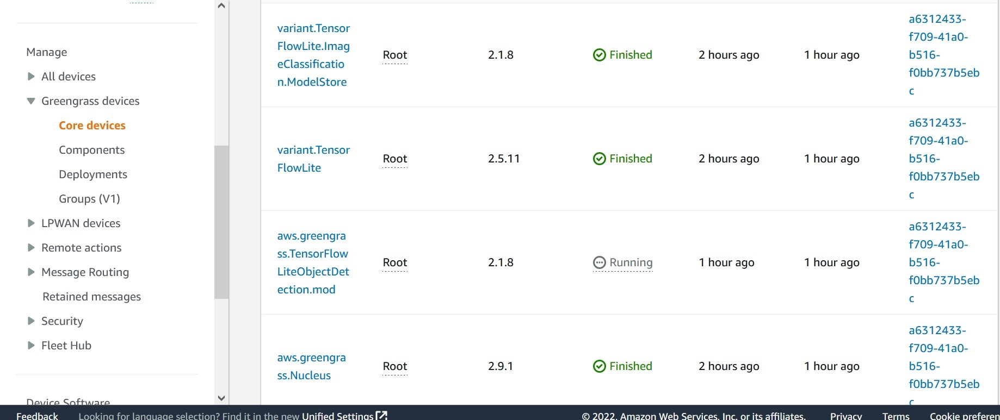

# Revise the original deployment and update it with the new TensorFlow component

Once we have successfully created a new TensorFlow component (aws.greengrass.TensorFlowLiteObjectDetection.mod) compatible with our Raspberry Pi device, we will revise the existing deployment and replace the original TensorFlow component (aws.greengrass.TensorFlowLiteObjectDetection) with the new one (aws.greengrass.TensorFlowLiteObjectDetection.mod). 

Select your Greengrass device in: AWS IoT-->Manage-->Greengrass devices --> Core devices
Then click to open the tab "Deployments" and select the deployment with the original components created initially. 

Click on *Actions* and select *Revise* as shown in the picture below.

  
  
In the list of available components we will select our newly created component: **aws.greengrass.TensorFlowLiteObjectDetection.mod**
  

  
  
Make sure the original TensorFlow component (aws.greengrass.TensorFlowLiteObjectDetection) is **NOT selected** and the other three componets ARE selected as shown in the picture below. 
  

  
  
Next we will configure the new **aws.greengrass.TensorFlowLiteObjectDetection.mod** component. 
To do so, select the component in the next screen and click on *Configure component*
  

  
  
We will set **two configuration parameters** as shown in the picture below:
  

  
  
*InferenceInterval*: The time in seconds between each prediction made by the inference code. 

*UseCamera*: String value that defines whether to use images from a camera connected to the Greengrass core device. Supported values are true and false. We should set it up as "true".

Finally we select Next in the following screens and then Deploy.

A succesfull deployment will show the **four components of the deployment** as shown below. 

  

  

Now let's point the camera towards a person (myself), enable the GPS in the mobile phone and subscribe to the IoT topic to see the results:
  

  

To see the results, we will use the **MQTT test client** and subscribe to the topic "ml/tflite/object_detection"
  

  
  

As you can see from the capture a "person" has been detected.  
The position of the person as reported in the MQTT message corresponds with the GPS caputre of the mobile device (see the picture)
>Note *The cell phone used to take the picture is also detected*

