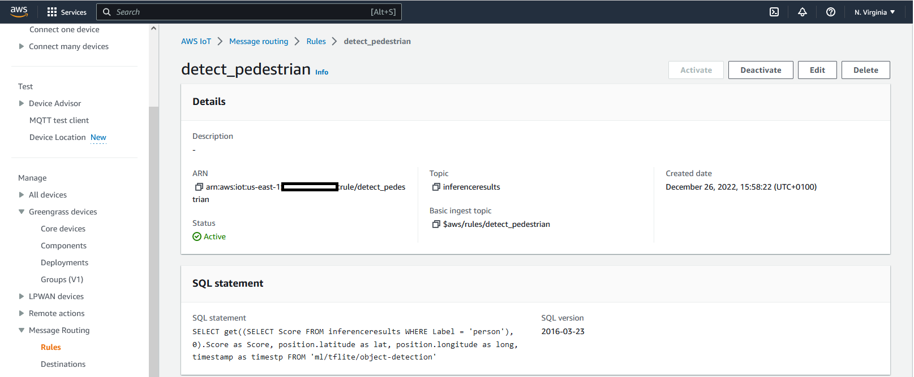
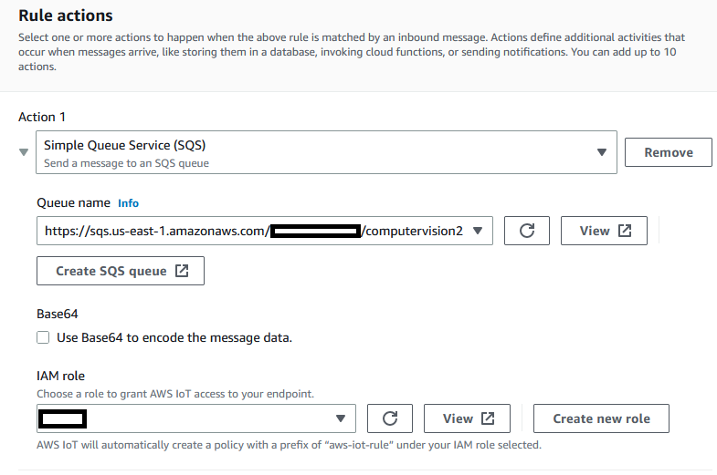
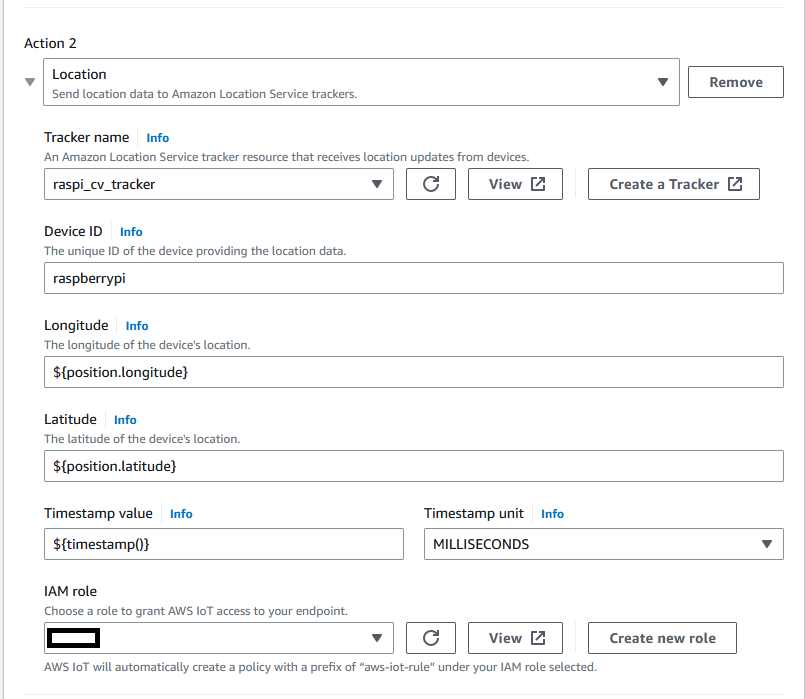
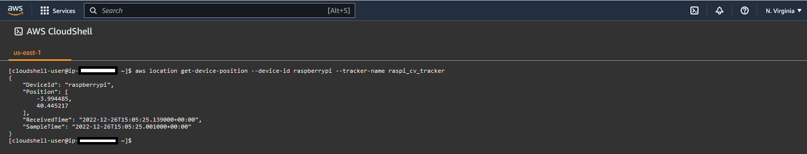
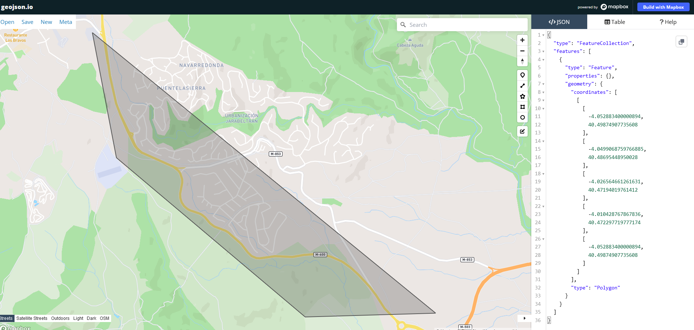
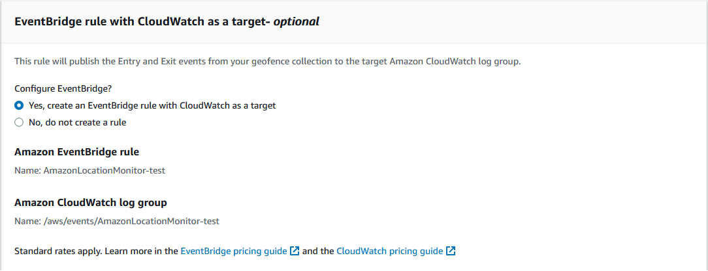
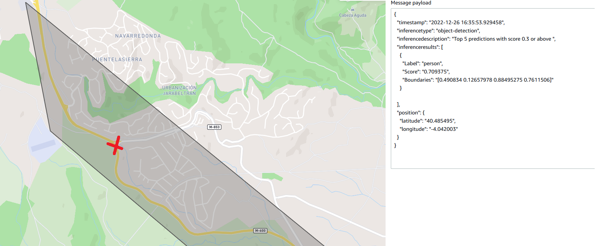
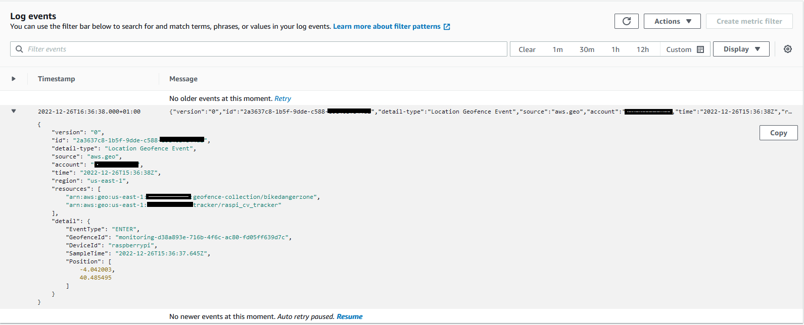

# Define the IoT Core rules and configure AWS Location Service

So far we have been able to: 
 * Detect objects with our USB camera attached to our Raspberry Pi device
 * Capture the location of those objects 
 * Publish a message with the object detected and location to an IoT topic in the cloud.

**Next** we will define a rule in AWS IoT Core so **only if** the object detected is a pedestrian (person) a warning will be issued. 

We also want to track the places (positions) where pedestrians are detected so we will use  **AWS Location Service** as a destination of the IoT Core messages filtered by the rule.

To create a new IoT Rule, navigate to *Manage-->Message routing-->Rules* and then click on *Create Rule*.

We will create a **nested sql query** as shown in the picture below. 
For details on *nested sql queries* please visit *https://docs.aws.amazon.com/iot/latest/developerguide/iot-sql-nested-queries.html*

  

Then we will define two actions: 

Action 1: We will send a message to a SQS queue

  

Note: Instructions about how to create a SQS queue can be found at: https://docs.aws.amazon.com/AWSSimpleQueueService/latest/SQSDeveloperGuide/step-create-queue.html

Action 2: We will send a message to a Location Service tracker. 

  

>Note Instruction about how to create a Location Service tracker can be found at *https://docs.aws.amazon.com/location/latest/developerguide/start-tracking.html*

We can see now how our Location Service tracker gets updated with the positions of the persons being detected by our Raspberry Pi.

  

## **Creating a Geofence**
Next let's create a geofence and link it to our tracker. We want to give a special treatment to the detection of pedestrians that take place in a particular dangerous road.
The geofence json file with the coordinates of the polygon are available in the folder of this chapter: *geofence.json*
You may use your own geofence definition. The following online tool can help you define your own geofence area: *https://geojson.io*

Our geofence corresponds to a dangerouse road shown below.

  
Instructions about how to create the geofence and link it to a tracker can be found at: https://docs.aws.amazon.com/location/latest/developerguide/add-geofences.html

During the creation process, we will select the option to **"Yes, create an EventBridge rule with CloudWatch as a target"**, as shown below: 

  

Next we will detect a pedestrian in a spot inside the geofence. The exact location is represented in the map below with a red cross.

  

We can now navigate to **AWS CloudWatch** and select the log group created. 
An *ENTER* event has been logged for the pedestrian detection inside the geofence area.

  
  

**Congratulations! This completes the workshop.** 