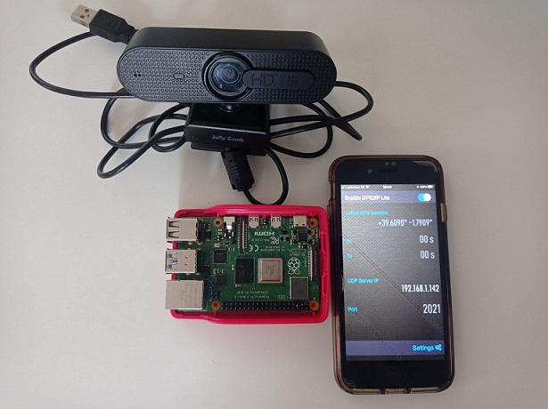

# Location based object detection with Raspberry Pi 

In this workshop you will implement and experiment an **end to end computer vision use case**. The goal is to demo an end to end solution to detect vulnerable road users like pedestrians and then report the location where those users have been detected. Moreover, if the detection happens in a particular area like a dangerous road, an alarm is raised. 

To make it as real as possible we avoid to use simulation elements. The downside is that you need specific hardware to complete with workshop as is. 

The object detection inference is performed with a **Raspberry Pi device** at the edge. Geolocation corresponds with the actual position of the Raspberry Pi that the device  reports reading the **GPS of a mobile phone** paired with it. Images are taken with a **USB camera** attached to the Raspberry Pi. The area selected for geofencing corresponds to a **dangerous road** and we explain how to provide the corresponding **geofence**. 

The picture below shows the devices used for the demo: 

a) Raspberry Pi 4 Model B  (Debian 11 (Bullseye)) 

b) Iphone SE (iOS version 16.1.2)

c) Jelly Comb USB Camera

  

  
The workshop is comprised by **five parts**:

1. **Pair the Raspberry Pi and a Mobile Phone GPS**
You'll start pairing your Raspberry Pi with a mobile phone. We will deploy a GPS application in the mobile phone and stream the real location from the GPS  the phone to the Raspberry Pi. 

2. **AWS IoT Greengrass and computer vision model**

Then you will install the AWS IoT Greengrass Core software to the Raspberry Pi. Next you will deploy a public TensorFlow computer vision component in your Raspberry Pi.The model is a pre-trained Single Shot Detection (SSD) MobileNet 1.0.

3. **Create a new AWS IoT Greengrass component**

After that you will create your own  AWS IoT Greengrass component leveraging the public component in step 2 before. We will create a set of artifacts for the new component. Our commponent addresses two gaps of the public TensorFlow component in step 2:  

        * It is compatible with the USB Camera.

        * It reports the location of the Raspberry Pi together with the computer vision inference, all in the payload of a unique mqtt message. 

4. **Deploy the model and test**

The next step is to test it in action. You will run your model at the edge and publish a message to IoT Core when a pedestrian is detected, together with its geolocation. 

5. **AWS Location Service integration**

Finally you will setup a tracker in Location Service and a geofence, so that if the detection happens within a specific area - a segment of a road - , a special warning is issued. 

  

