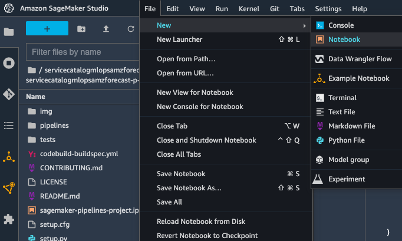
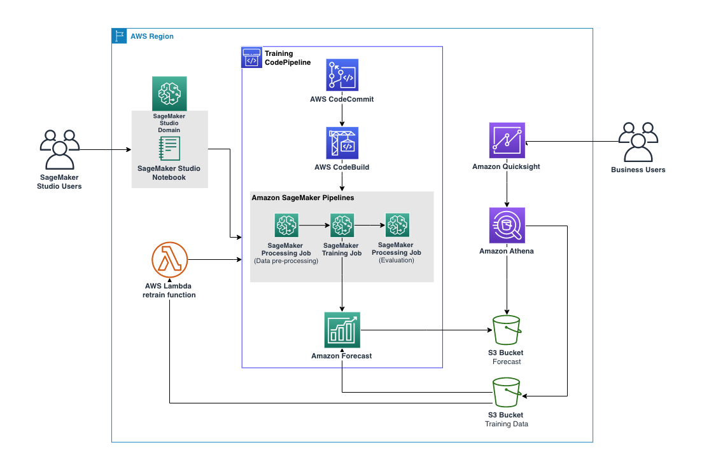

# How to create a custom SageMaker MLOps Project using Amazon Forecast for training

SageMaker Projects help organizations set up and standardize developer environments for data scientists and CI/CD systems for MLOps engineers. Projects also help organizations set up dependency management, code repository management, build reproducibility, and artifact sharing.

You can provision SageMaker Projects from the AWS Service Catalog using custom or SageMaker-provided templates. With SageMaker Projects, MLOps engineers and organization admins can define their own templates or use SageMaker-provided templates. The SageMaker-provided templates bootstrap the ML workflow with source version control, automated ML pipelines, and a set of code to quickly start iterating over ML use cases.

In this lab, we will re-use one of the MLOps Projects that are available through SageMaker Studio and make modifications on the pipeline to enable time series data training in Amazon Forecast. Later, we will show how we can use the modified template to create a new Portfolio and Product in AWS Service Catalog, that will allow us to re-utilize the new custom project across our Organization

-----------------

## **Launch Amazon SageMaker Studio**

Amazon SageMaker Studio is a web-based, integrated development environment (IDE) for machine learning that lets you build, train, debug, deploy, and monitor your machine learning models. Studio provides all the tools you need to take your models from experimentation to production while boosting your productivity. 

Here are the one-time steps for onboarding to Amazon SageMaker Studio:
1. Open AWS console and switch to AWS region you would like to use.

     

2. In the search bar, type SageMaker and click on Amazon SageMaker.

     

3. Choose **Studio** at the top left of the page.

     

4. Click on **Launch SageMaker Studio**.

     

5. Define **Name** as **sagemakeruser** for example.

     

6. Select **Create a new role** under Execution role.

     

7. Select **Any S3 bucket** and click **Create Role**.

     

8. You will see that the role is successfully created.

     

9. Click **Submit**. The SageMaker Studio environment will stay in Pending state for a few minutes.

     

10. After a few minutes, the SageMaker Studio Domain will be provisioned. Click on **Studio** under **Launch app** on the right of the screen.

     

11. The page can take 1 or 2 minutes to load when you access SageMaker Studio for the first time. You will be redirected to a new web tab that looks like this:

     


## **MLOps Template for building and training**

SageMaker projects introduce MLOps templates that automatically provision the underlying resources needed to enable CI/CD capabilities for your ML development lifecycle. You can use a number of built-in templates or create your own custom template (https://docs.aws.amazon.com/sagemaker/latest/dgsagemaker-projects-templates-custom.html). You can use SageMaker Pipelines independently to create automated workflows; however, when used in combination with SageMaker projects, the additional CI/CD capabilities are provided automatically. The following architecture shows how the three components of SageMaker Pipelines can work together in an example SageMaker Project for model build, model train and model deploy.


>NOTE: For this lab we will use MLOps template for model build and model train without the deploy block.

Lets first create the model build and model train MLOps project and take a detailed look at what AWS services are launched using the project template. Later, we will discuss how to modify the skeleton for a custom use case. 

1. In SageMaker Studio, from the left panel menu select **Projects** on the drill down selector.

     

2. Once you choose Projects, click on **Create project** as below:

     

3. On the projects page, you can launch a preconfigured SageMaker MLOps template. For this lab, we will choose the **MLOps template for model building and model training**. Click on the project name and click on the "Select project template" button.

     

4. Next, give a name to the project, a short description and click on the **Create Project** button.

     

5. Wait until the project is created. Behing the scenes, a CloudFormation template is deployed including the components shown in following architecture:

     

Included in the architecture are the following AWS services and resources that we are going to re use:

* ModelBuild repository provides seed code to create a multi-step model building pipeline including the following steps: data processing, model training and model evaluation. As you can see in the pipeline.py file, this pipeline trains a linear regression model using the XGBoost algorithm on the well-known UCI Abalone dataset. This repository also includes a build specification file, used by AWS CodePipeline and AWS CodeBuild to run the pipeline automatically.

* The ModelBuild pipeline automatically triggers and runs the pipeline from end to end whenever a new commit is made to the ModelBuild CodeCommit repository.

* A SageMaker Pipeline workflow that contains the directed acyclic graph (DAG) that pre-processes data, trains and evaluates our model. Each step in the pipeline keeps track of the lineage and intermediate steps can be cached for quickly re-running the pipeline. Outside of templates, you can also create pipelines using the SDK.

All SageMaker resources, such as processing jobs, training jobs and pipelines, as well as AWS resources listed in this lab, are automatically tagged with the project name and a unique project ID tag.

## **Clone the ModelBuild repository**

To modify the sample code from this launched template, we first need to clone the ModelBuild CodeCommit repository to our local SageMaker Studio instance. From the list of projects, choose the one that was just created. On the Repositories tab, you can select the hyperlinks to locally clone the CodeCommit repo.

 


## **Download training data**

1. From the modelbuild repository root directory create a new Notebook.

    

2. Click on the **Select** button on the *Set up notebook environment window* and wait until the notebook kernel is started.

3. Paste the following code to into a cell from the Notebook to download and load the training data to our SageMaker Studio session bucket:

    ```
    !aws s3 cp s3://aimlworkshopspipeline-workshopresourcesbucket-22rpkozo2usk/amazon-forecast-mlops-workshop/data/train.csv ./
    import boto3
    import os
    import sagemaker
    prefix = 'amazon-forecast-mlops'
    region = boto3.Session().region_name
    default_bucket = sagemaker.session.Session().default_bucket()
    RawData = boto3.Session().resource('s3')\
    .Bucket(default_bucket).Object(os.path.join(prefix, 'data/train.csv'))\
    .upload_file('./train.csv')
    print(os.path.join("s3://",default_bucket, prefix, 'data/train.csv'))
    !rm -rf ./train.csv
    ```

3. Close the notebook and delete it from the repository root directory, we won't be needing it anymore.

4. Copy the full URI for the training data. You will need this later on to modify the **input_train** parameter in the pipeline.py script. For this example:

    ```
    s3://<your sagemaker s3 bucket>/amazon-forecast-mlops/data/train.csv
    ```

## **Modify the seed code on the ModelBuild Repo:**

The ModelBuild repository contains the code for preprocessing, training, and evaluating the model. The sample code trains and evaluates a model on the UCI Abalone dataset. We can modify these files to solve our own use case. 

1. Navigate to the **pipelines** directory inside the modelbuild directory and rename the **abalone** directory to **amazon_forecast_mlops** (as shown below).

     

2. Now, navigate up one directory level and open the **codebuild-buildspec.yml** file in the modelbuild directory. Modify the run pipeline path from run-pipeline --module-name pipelines.abalone.pipeline to this:

    ```
    run-pipeline --module-name pipelines.amazon_forecast_mlops.pipeline \
    ```

    This is also shown in the image below - line 15.

     

    Save the file.

3. Navigate to the **pipelines** directory and replace the **preprocess.py** code under the **amazon-forecast-mlops** folder with the [preprocessing script found in the sample repository](https://github.com/sgarcesv/aws-amazon-forecast-mlops/blob/d943067cfb37ddda935ec94b6067f7983c8bc4da/seed-code-amazon-forecast-sm-pipeline-mlops/pipelines/amazonforecast/preprocess.py).

    Save the file.

4. Rename the **evaluate.py** to **conditional_delete.py** under the **amazon-forecast-mlops** folder and replace the code with the [conditional delete script found in the sample repository](https://github.com/sgarcesv/aws-amazon-forecast-mlops/blob/d943067cfb37ddda935ec94b6067f7983c8bc4da/seed-code-amazon-forecast-sm-pipeline-mlops/pipelines/amazonforecast/conditional_delete.py).

    Save the file.

5. Replace the **pipeline.py** code with the [amazon forecast pipeline script](https://github.com/sgarcesv/aws-amazon-forecast-mlops/blob/86f63b8d37f7031db39ccc1a1df7c9107b4abdbe/seed-code-amazon-forecast-sm-pipeline-mlops/pipelines/amazonforecast/pipeline.py) found in the sample repository. Be sure to replace the **input_train** parameter (line 138 of pipeline.py) with the Amazon S3 URI you obtained previously in the **Download training data** section:

    ```
    input_train = ParameterString(
        name="TrainData",
        default_value=f"s3://<your sagemaker s3 bucket>/amazon-forecast-mlops/data/train.csv",
    )
    ```

    >NOTE: Replace <your sagemaker s3 bucket> with your s3 bucket name

     

    Save the file.

6. Right click on the left panel, select **New File** and rename it **train.py**. Open the file and paste the code from the [amazon forecast training script](https://github.com/sgarcesv/aws-amazon-forecast-mlops/blob/d943067cfb37ddda935ec94b6067f7983c8bc4da/seed-code-amazon-forecast-sm-pipeline-mlops/pipelines/amazonforecast/train.py).

     

     

    Save the file.

7. **OPTIONAL**: Modify the **Readme.md** file located at the root of the repository directory to reflect the changes.

7. Create a zip file of all the content that will be used as seed code to deploy our custom project from Service Catalog. Open a New terminal.

    

8. Install zip package, navigate to the repository directory and zip the file:

    ```
    sudo yum install zip -y
    cd servicecatalogmlopsamzforecast-p-*/sagemaker-servicecatalogmlopsamzforecast-p-*-modelbuild/  ### Replace with your repository directory name
    zip -r seed-code-amazon-forecast-sm-pipeline-mlops.zip *
    ```
    
    >NOTE: Replace with your directory and sub directory names.

9. Download the zip file located in the root directory of the model build repository and upload the file to s3.

    >NOTE: For this example, we will upload the zip file in the same bucket we are using to upload the training data.

10. From the AWS Console search for **s3** and and open in a new tab.

     

11. Click on the bucket. For this example **sagemaker-eu-west-1-\***

12. Click on the **amazon-forecast-mlops** and create a folder.

     

13. Name the folder **seedcode** and click on the **Create folder** button.

14. Click on the **seedcode** folder and upload the zip file with the seed code you previously generated.

## **Add Amazon Forecast permissions to the SageMaker Service Catalog execution role**

The **AmazonSageMakerServiceCatalogProductsExecutionRole** is used to execute the pipeline.

1. From the AWS Console search for **IAM** and and open in a new tab.

     

5. On the left panel select **Roles** and paste the Execution role name **AmazonSageMakerServiceCatalogProductsExecutionRole**.

     

6. Click on the **AmazonSageMakerServiceCatalogProductsExecutionRole** Execution role.

7. Click on the **Add Permissions** drill down and select **Attach policies**.

     

8. Search for **AmazonForecastFullAccess**, select the policy and click on the **Attach policies** button.

     

9. We will also need to allow the Amazon Forecast Service to assume the role. Click on the **Trust relationships** tab.

     

10. Click on **Edit trust policy** and replace with the following policy.

    ```
    {
        "Version": "2012-10-17",
        "Statement": [
            {
                "Effect": "Allow",
                "Principal": {
                    "Service": [
                        "sagemaker.amazonaws.com",
                        "forecast.amazonaws.com"
                    ]
                },
                "Action": "sts:AssumeRole"
            }
        ]
    }
    ```

11. Scroll down and click on the **Update policy** button.

## **Triggering a pipeline run**

Committing these changes to the CodeCommit repository (easily done on the Studio source control tab) triggers a new pipeline run, because an Amazon EventBridge  event monitors for commits. After a few moments, we can monitor the run by choosing the pipeline inside the SageMaker project.

1. Go back to SageMaker Studio. To commit the changes, navigate to the Git Section on the left panel and follow the steps in the screenshots below:
    
    * Stage changes.

         
    
    * Stage untracked changes.

         

        >NOTE: Do not add the zip file created previously. If added, remove with the (-) symbol beside the file name. We don't want the sip file to be pushed into the repository.
     
    * Commit the changes by providing a Summary, your Name and an email address.

         

    * Push the changes.

         

2. From the AWS Console search for **CodePipeline** and open in a new tab. 

     

3. Click on the **sagemaker-ServiceCatalogMLOpsAmzForecast-p-\*-modelbuild** pipeline.

     

4. Review the pipeline is runnning.

     

5. Navigate back to the project in SageMaker Studio, select the Pipelines section and double click the MLOps pipeline with the name given when creating the project.

     

6. Wait a few seconds for the SageMaker Pipeline to start running. If you double click on the **Executing** pipeline, the steps of the pipeline will be shown in a new tab. You will be able to monitor the step that is currently running.

     

    <br/>

     

7. Verify the pipeline executes successfully after 30min aprox.

     

8. Lets verify the predictor has been created in Amazon Forecast. From the AWS Console search for Amazon Forecast and open in a new tab.

     

9. Click on the **View dataset groups** button.

     

10. Click on the **MLOPS_Pipeline_\*** dataset.

     

11. Click on the **View Predictors** button, and review the new predictor.

     

     

## **Copy the MLOps Project CloudFormation template**

We will now download the template used to deploy the model build and model training project and update the seedcode with our new code:

1. From the AWS Console search for **CloudFormation** and and open in a new tab.

     

2. First we will download the CloudFromation project deployed previously with the SageMaker Project. Click on Stacks and select the CloudFormation deployed with the MLOps project.

     

3. Click on the template tab.

     

4. Copy the content and create a file locally in your computer.

5. Name the file **amazon_forecast_mlops_cftemplate.yaml**. This file will be used to create the Product in AWS Service Catalog.

6. Modify the seed code to point to the SageMaker Session S3 bucket were you uploaded the .zip file previously. Be careful with the indentation.

    ```
      'Code':
        'S3':
          'Bucket': '<YOUR BUCKET NAME>'
          'Key': 'amazon-forecast-mlops/seedcode/seed-code-amazon-forecast-sm-pipeline-mlops.zip'
    ```
    
    For the product to work with SageMaker projects, review the following parameters exist in the product template.

    ```
    SageMakerProjectName:
    Type: String
    Description: Name of the project

    SageMakerProjectId:
    Type: String
    Description: Service generated Id of the project.
    ```

    >NOTE: The code repository needs to be zipped.

7. Save the file 


## **Create a Portfolio and Product in AWS Service Catalog for re utilization in your Organization**

Open AWS Service Console through the AWS Console.

 

To create a custom project template, complete the following steps.

1. Click on **Portfolio** on the left panel.

     

2. Click on the **Create portfolio** button. 

     

3. Add a Name, Owner and Description and click on **Create**.

     

4. Click on the Portfolio you just created and select **Upload new product**.

     

5. Add Name, Description and upload the CloudFormation template created in the previous steps. In our example **amazon_forecast_mlops_cftemplate.yaml**. Scroll down and click on **Create**.

     

    >NOTE: If the product does not appear yet, click the refresh button.

6. A launch constraint designates an IAM role that AWS Service Catalog assumes when a user launches a product. Click on the **Constraints** tab and click on **Create constraint** button.

     

7. Select the Product you created in the previous step and Constraint type **Launch**.

     

8. Select the Method **Select IAM role** and IAM role **AmazonSageMakerServiceCatalogProductsLaunchRole**. Click on **Create**.

     

9. Click on the **Groups, roles, and users** tab and click on the **Add groups, roles, users** button.

     

9. On the **Roles** tab, select **AmazonSageMaker-ExecutionRole-\*** and click on **Add Access**.

     

10. To make your project template available in your Organization templates list in Studio, create a tag with the following key and value to the AWS Service Catalog product you created previously. Click on the new product on the **Products** tab, go to the **Tags** tab and add the following key value pairs. 

    * key: sagemaker:studio-visibility
    * value: true

    <br/>

     

11. Click on the **Add tag** button.

## **Modify roles to allow Service catalog to create a predictor in Amazon Forecast**

Now we need to give permissions for the role to access Amazon Forecast.

1. On IAM select **Roles** on the left panel, search for **AmazonSageMakerServiceCatalogProductsUseRole** and click on the role.

     

2. Click on the Add permission drill down and select **Attach policy**.

3. Add **AmazonForecastFullAccess**

4. Allow Amazon Forecast to assume the role. Click on the **Trust relationships** tab and replace with the following json snippet:

    ```
    {
        "Version": "2012-10-17",
        "Statement": [
            {
                "Effect": "Allow",
                "Principal": {
                    "Service": [
                        "codepipeline.amazonaws.com",
                        "cloudformation.amazonaws.com",
                        "codebuild.amazonaws.com",
                        "firehose.amazonaws.com",
                        "sagemaker.amazonaws.com",
                        "events.amazonaws.com",
                        "states.amazonaws.com",
                        "apigateway.amazonaws.com",
                        "glue.amazonaws.com",
                        "lambda.amazonaws.com",
                        "forecast.amazonaws.com"
                    ]
                },
                "Action": "sts:AssumeRole"
            }
        ]
    }
    ```

5. Click on **Update policy**.

## **Deploy MLOps Amazon Forecast custom project**

After you complete these steps, SageMaker Studio users in your organization can create a project with the template you created by following the steps in **Create an MLOps Project using Amazon SageMaker Studio** and choosing **Organization templates** when you choose a template.

1. Go to SageMaker Projects in SageMaker Studio.

2. Click on **Create project** and choose **Organization templates**, click on the new product and on the **Select project template** button.

     

3. Provide a Name and click on the **Create project** button.

     

Wait a few minutes a you will have a project to start working on your training in Amazon Forecast!!!


## **Conclusion**
In this lab we have walked through how an ML engineer can re utilise one of the SageMaker MLOps project templates to create a custom project in Service Catalog for their organization. In this example, using Amazon Forecast for training. Among the many benefits of using SageMaker Projects is that the changes to the source code can be tracked, associated metadata can be tied to trained models for deployment approval, and repeated pipeline steps can be cached for reuse. Ones the SageMaker Pipeline executes successfully, we can use the code changes as seed_code for creating an MLOps project for reutilization in our organization.

As optional steps we could use AWS Lambda to trigger retraining when new training data is loaded into s3. To visualize the forecast predictions we could configure Amazon Athena and Amazon Quicksight to visualize and analyze the results. But that is out of scope for this workshop :)



