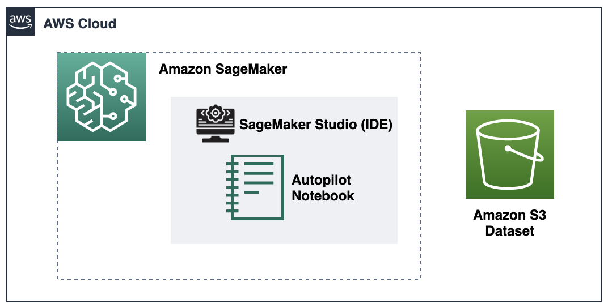
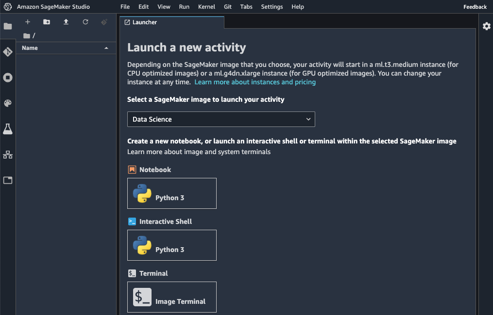
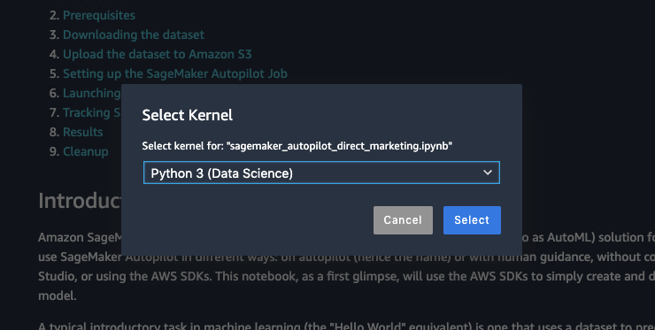
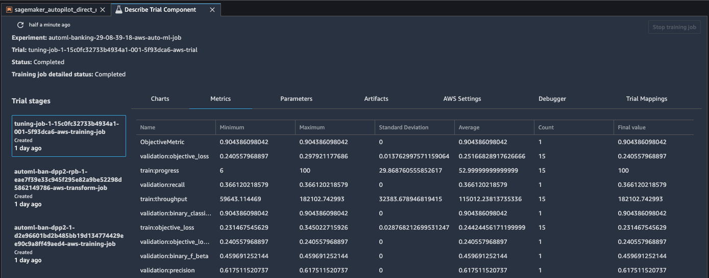
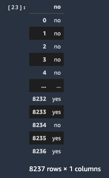
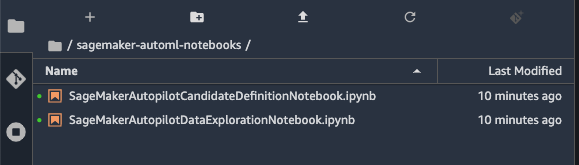

# Amazon SageMaker Autopilot SDK laboratory

In this lab, you will get to know **Amazon SageMaker Autopilot** by using the SDK through the following steps:
1. Creating a new **Amazon SageMaker Studio** profile
    >*Note: If you already have an Studio profile in your account skip the onboarding step below.*
    * Onboard to Amazon SageMaker Studio with the QuickStart
    * Open Studio
2. Working with an **Amazon SageMaker Autopilot** notebook in Studio
    * Exploring the notebook
    * Creating an **Amazon SageMaker Experiment** for organizing our candidates
    * Launching an **Amazon SageMaker Autopilot** job
    * Checking the results of the job
    * Performing an **Amazon SageMaker Batch Inference** with our best model

<br>



-----------------

## **Creating a new Amazon SageMaker Studio profile**

First, onboard to SageMaker Studio using the Quick start:
* Open the AWS Console for your account.
* Look for Amazon SageMaker and click on it.
* Choose *Amazon SageMaker Studio* at the top left of the page.


* On the Amazon SageMaker Studio Control Panel, under Get started, choose Quick start.
    * For "User name", keep the default name or create a new name. The name can be up to 63 characters. Valid characters: A-Z, a-z, 0-9, and - (hyphen).
    * For Execution role, choose "Create a new role", the Create an IAM role dialog opens. For S3 buckets you can choose "None".
    * Choose "Create role". Amazon SageMaker creates a new IAM role with the AmazonSageMakerFullAccess policy attached.
    * Choose "Submit".
* On the Amazon SageMaker Studio Control Panel, under Studio Summary, wait for "Status" to change to "Ready".


* When Status is Ready, the user name that you specified is enabled and chosen. The Add user and Delete user buttons, and the Open Studio link are also enabled.
* Choose "Open Studio". The Amazon SageMaker Studio loading page displays. When Studio opens you can start using it (this can take a few mins the first time).

    > Now that you've onboarded to Amazon SageMaker Studio, in the future you can directly use the following steps to access Studio:
    > * Open the Amazon SageMaker console.
    > * Choose "Amazon SageMaker Studio" at the top left of the page.
    > * On the Amazon SageMaker Studio Control Panel, choose your user name and then choose "Open Studio".


## **Working with an Amazon SageMaker Autopilot notebook in Studio**

> Note SageMaker Autopilot can be used either from the graphical interface via the SageMaker Studio Launcher, or with code via the SageMaker SDK. In the following steps we will follow the SDK alternative.

Now that your SageMaker Studio is open, you will get the notebook that we will be using and follow the steps on it:
* If not open already, create a new Studio Launcher tab by going to "File"->"New Launcher".



* Click on "Image Terminal" to open a new terminal tab.
* Copy-paste the following command in the terminal and hit enter. This will copy the notebook to your Studio local environment.
    ``` javascript
    wget https://github.com/rodzanto/ml-workshop/raw/toro/machine-learning/sagemaker-autopilot-sdk/sagemaker_autopilot_direct_marketing.ipynb
    ```


* In the left menu go to the "File Browser" (folder icon at the top-left).
* Double click the notebook file called *"sagemaker_autopilot_direct_maketing.ipynb"*. The notebook will open on a new tab.
* In the select kernel pop-up, select "Python (Data Science)".



* Now **read** and follow the cells in the notebook one by one.
    > If you are new to Jupyter notebooks, you can run the notebook document step-by-step (one cell a time) by pressing "shift" + "enter". Note:
    > * While a cell is running it will show an asterix "*" next to it
    > * When the cell execution completes it will show the execution number

The notebook will guide you through the process for performing the following tasks:
* Download the public Direct Marketing dataset.
* Explore the data, split it into training and test, and upload to Amazon S3.
* Set-up the SageMaker Autopilot job.
* Launch the SageMaker Autopilot job.
    > Note the full AutoML process will take approximately 20 minutes to complete.
* Once completed it will show the results.
    > Note you can also explore the results in the Studio Experiments section:



* Perform a SageMaker batch inference job, for predicting many records stored at S3 with our best Autopilot model.



    > Note with SageMaker you can either deploy Endpoints for real-time inference, or performing batch inferences (like you do in this lab) for going through a set of records in files stored at S3. You can use one or the other depending on your specific use case.

* Optionally, explore the resulting notebooks from the Autopilot job.
    > Note Amazon SageMaker Autopilot allows you to use the AutoML job as a base, for further adjusting or continue improving your data-science work, by working with the resulting notebooks.



Congratulations! You have completed this lab.
