# Amazon SageMaker Studio Autopilot laboratory

In this lab, you will use the **Autopilot** and **Experiments** fetures integrated on the **Amazon SageMaker Studio** UI.

Amazon SageMaker Autopilot is an automated machine learning (commonly referred to as AutoML) solution for tabular datasets. You can use SageMaker Autopilot in different ways: on autopilot (hence the name) or with human guidance, without code through SageMaker Studio, or using the AWS SDKs. This lab will use the Amazon SageMaker Studio UI to simply create and deploy a machine learning model.

A typical introductory task in machine learning (the "Hello World" equivalent) is one that uses a dataset to predict whether a customer will enroll for a term deposit at a bank, after one or more phone calls. For more information about the task and the dataset used, see Bank Marketing Data Set.

Direct marketing, through mail, email, phone, etc., is a common tactic to acquire customers. Because resources and a customer's attention are limited, the goal is to only target the subset of prospects who are likely to engage with a specific offer. Predicting those potential customers based on readily available information like demographics, past interactions, and environmental factors is a common machine learning problem. You can imagine that this task would readily translate to marketing lead prioritization in your own organization.

This lab demonstrates how you can use Autopilot on this dataset to get the most accurate ML pipeline through exploring a number of potential options, or "candidates". Each candidate generated by Autopilot consists of two steps. The first step performs automated feature engineering on the dataset and the second step trains and tunes an algorithm to produce a model. When you deploy this model, it follows similar steps. Feature engineering followed by inference, to decide whether the lead is worth pursuing or not. The lab contains instructions on how to train the model as well as to deploy the model to perform real time predictions.

There are two main tasks to be performed on this lab:

1. Creating a new **Amazon SageMaker Studio** profile
    >*Note: If you already have an Studio profile in your account skip the onboarding step below.*
    * Onboard to Amazon SageMaker Studio with the QuickStart
    * Open Studio

2. Running an **Amazon SageMaker Autopilot** job from the UI:
    * Launching an **Amazon SageMaker Autopilot** job
    * Checking the generated notebooks
    * Checking the results of the job
    * Deploying the best model
    * Performing an inference with our deployed model


-----------------

## **Creating a new Amazon SageMaker Studio profile**

First, onboard to SageMaker Studio using the Quick start:
* Open the AWS Console for your account.
* Look for Amazon SageMaker and click on it.
* Choose *Amazon SageMaker Studio* at the top left of the page.

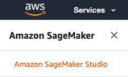

* On the Amazon SageMaker Studio Control Panel, under Get started, choose Quick start.
    * For "User name", keep the default name or create a new name. The name can be up to 63 characters. Valid characters: A-Z, a-z, 0-9, and - (hyphen).
    * For Execution role, choose "Create a new role", the Create an IAM role dialog opens. For S3 buckets you, choose "Any S3 bucket".
    * Choose "Create role". Amazon SageMaker creates a new IAM role with the AmazonSageMakerFullAccess policy attached.
    * Choose "Submit".
* On the Amazon SageMaker Studio Control Panel, under Studio Summary, wait for "Status" to change to "Ready".

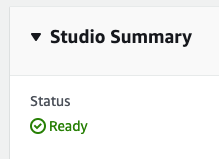

* When Status is Ready, the user name that you specified is enabled and chosen. The Add user and Delete user buttons, and the Open Studio link are also enabled.
* Choose "Open Studio". The Amazon SageMaker Studio loading page displays. When Studio opens you can start using it (this can take a few mins the first time).

    > Now that you've onboarded to Amazon SageMaker Studio, in the future you can directly use the following steps to access Studio:
    > * Open the Amazon SageMaker console.
    > * Choose "Amazon SageMaker Studio" at the top left of the page.
    > * On the Amazon SageMaker Studio Control Panel, choose your user name and then choose "Open Studio".


## **Running an Amazon SageMaker Autopilot job in Studio**

> Note SageMaker Autopilot can be used either from the graphical interface via the SageMaker Experiments feature, or with code via the SageMaker SDK. In the following steps we will follow the UI alternative.

### Obtain the training dataset

Before setting up a new Autopilot job, we need to set up an S3 bucket that will serve as storage for all the inputs and putputs of the proccess.

1. From the Studio Launcher tab (File > New launcher), launch a System Terminal and execute the following commands.

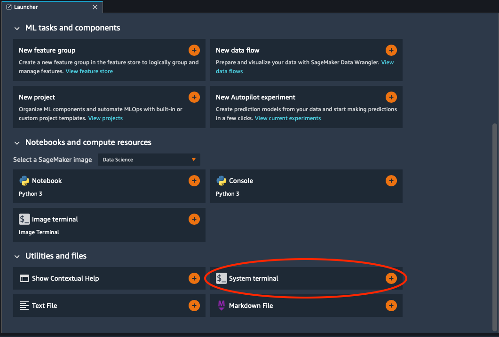

2. First, let's create the S3 bucket:

```
  aws s3 mb s3://sm-autopilot-lab-$AWS_ACCOUNT_ID
```

3. Now let's grab the dataset that Autopilot will use to train the model and upload it to our bucket:

```
  curl https://sagemaker-sample-data-us-west-2.s3-us-west-2.amazonaws.com/autopilot/direct_marketing/bank-additional.zip --output bank-additional.zip
  sudo yum -y install unzip
  unzip bank-additional.zip
```

4. Finally, upload the dataset to our bucket:

```
  aws s3 cp bank-additional/bank-additional-full.csv s3://sm-autopilot-lab-$AWS_ACCOUNT_ID
```

Now that data is ready, we can take a look at the source data from the local copy we have on Studio's shared storage:

For that matter, go to the File browser symbol on the lefty side of the screen, and browse the _bank-additional_ folder.
Double click on _bank-additional-full.csv_ to explore it on a new tab.

You can see the objective variable (_y_) and the variables that will be used to train the model. For a datailed explanation of every field, double click on _bank-additional-names.txt_.

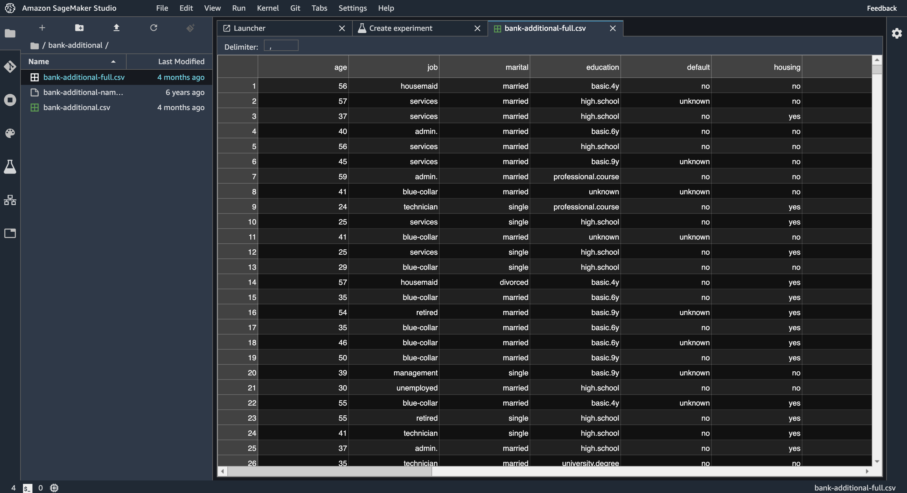

### Launch the Autopilot job

Now that we have explored the source dataset, let's launch a new Autopilot job.

For this matter, go to the Experiments tab on the left side of the screen, and click on __Create Experiment__.

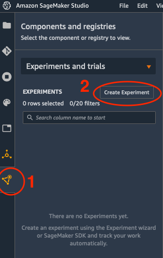

1. Fill in the experiment parameters as follows:

* Experiment name: _sm-autopilot-lab_
* Input data location:
  * Select _Find S3 bucket_
  * Choose S3 bucket name _s3://sm-autopilot-lab-YOUR_ACCOUNT_ID_
  * Select S3 object key prefix _bank-additional-full.csv_

* Target attribute name: _y_

* Output data location:
  * Choose _Find S3 bucket_
  * Choose S3 bucket name _s3://sm-autopilot-lab-YOUR_ACCOUNT_ID_
  * Type S3 object key prefix _output_

* Select the machine learning problem type:
  * _Auto_ or _Binary classification_

> If you choose _Auto_, Autopilot will try to infer the problem type from the values of the target variable. In this case, we have a target variable (_y_) with 2 possible values (_yes_, _no_), so we are facing on a binary classification problem.

* Do you want to run a complete experiment?
  * "Yes"

> If you choose _Yes_ Autopilot will run the Data Exploration and Candidate Definition notebooks for you, and choose the best model at the end. If you choose _No, run a pilot to create a notebook with candidate definitions_, Autopilot will just generate the notebooks, that you will be able to modify and run later.

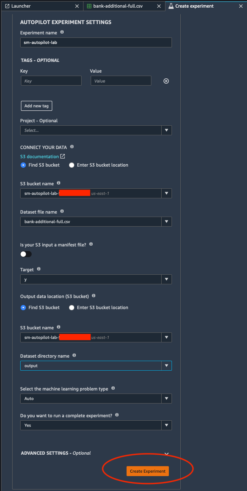

2. Click on __Create Experiment__

The SageMaker Autopilot job consists of the following high-level steps:

* __Analyzing Data__, where the dataset is analyzed and Autopilot comes up with a list of ML pipelines that should be tried out on the dataset. The dataset is also split into train and validation sets.
* __Feature Engineering__, where Autopilot performs feature transformation on individual features of the dataset as well as at an aggregate level.
* __Model Tuning__, where the top performing pipeline is selected along with the optimal hyperparameters for the training algorithm (the last stage of the pipeline).

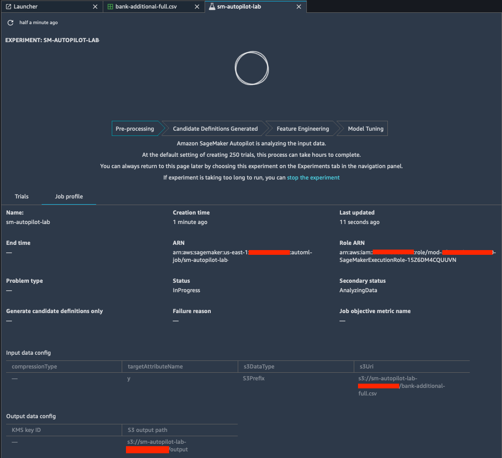

### Explore the generated notebooks

After the __Analyzing data__ phase is completed, two new controls will be enabled on the Autopilot job window.

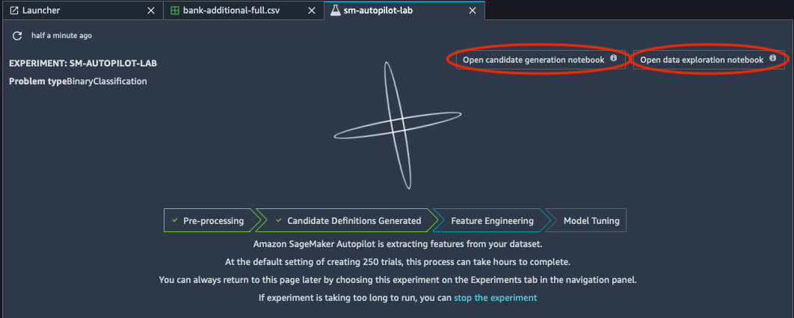

* __Open data exploration notebook__: this button opens the _Amazon SageMaker Autopilot Data Exploration_, where general daatset statistics are extracted and the problem type is defined.

> Explore the data exploration notebook to better understand the source dataset.

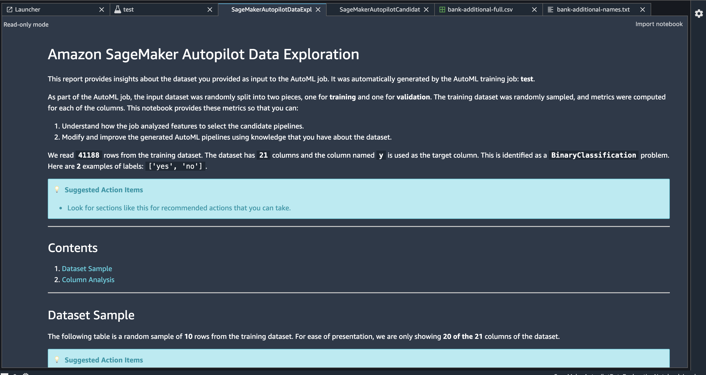

* __Open candidate definition notebook__: this button opens the _Amazon SageMaker Autopilot Candidate Definition Notebook_, that can be used to interactively step through the various steps taken by the Sagemaker Autopilot to arrive at the best candidate. This notebook can also be used to override various runtime parameters like parallelism, hardware used, algorithms explored, feature extraction scripts and more.

> Explore the candidate definition notebook to to understand how Autopilot generates various experiments to extract features and train the model, and finally does a multi-algorithm hyperparameter tuning.

A SageMaker AutoPilot model candidate consists of two fundamental components: a preprocessor and an algorithm. The preprocessor defines a data transformation strategy, and the algorithm determines which specific ML approach will be used for that model candidate. Both the preprocessor and the algorithm have configurable hyperparameters that change the way the component works. These hyperparameters will be optimized later in the Experiment process as part of an automated hyperparameter tuning job.

In our example, AutoPilot identified several model candidates for evaluation. For example, on one of the candidates, the data preprocessor (_dpp_) is _dpp0_, and the algorithm is _xgboost_. Together they make candidate definition _dpp0-xgboost_.


    dpp0-xgboost: This data transformation strategy first transforms ‘numeric’ features using RobustImputer 
    (converts missing values to nan), ‘text’ features using MultiColumnTfidfVectorizer.
    It merges all the generated features and applies RobustStandardScaler. The transformed data will be used 
    to tune a xgboost model.


> Note Amazon SageMaker Autopilot allows you to use the AutoML job as a base, for further adjusting or continue improving your data-science work, by working with the resulting notebooks.

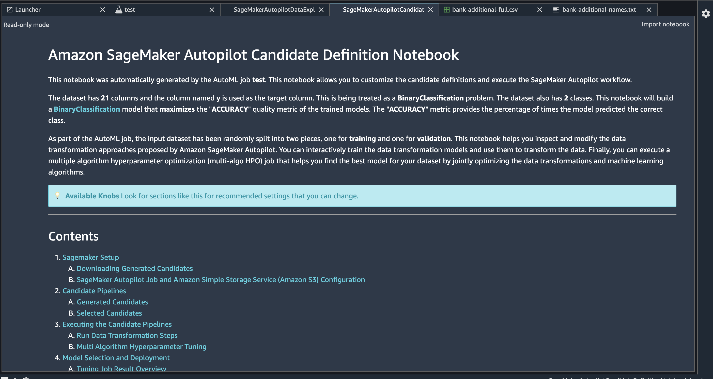

### Explore the experiment trials

After the notebooks are generated, Autopilot does a run of the _Candidate selection_ notebook:

* Executes the Candidate Pipelines
* Run Data Transformation Steps, and any feature engineering included in the preprocessor
* Executes a Multi Algorithm Hyperparameter Tuning, across 250 different combinations of hyperparameters.
* Identifies the best model candidate

As the Autopilot experiment advances through the __Feature Engineering__ and __Model Tuning__ stages, new trials will be executed, many of them at a time on parallel executions. Each of these trials is composed by several stages (for example, a _processing_ stage, followed by a _training job_, a _data transformation_ stage, and finally a _tuning job_ stage)

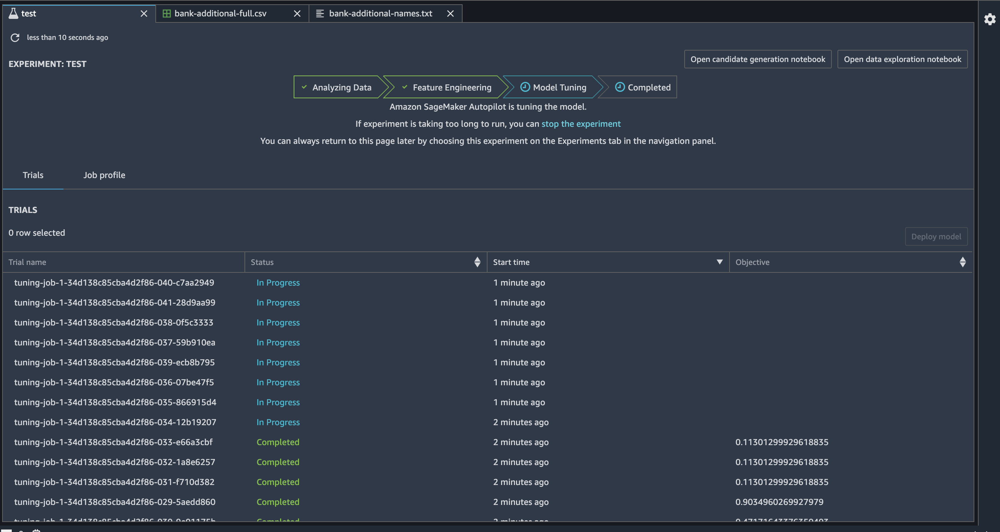

* Right click on a experiment Trial and choose __Open in trial details__: here you can check all the information stored for each of the trials:
  * Stages
  * Metrics
  * Parameters
  * Artifacts
  * Settings

* Go back to the Experiment view, right click on a experiment Trial and choose __Open in trial component list__: here you can compare all the trial components of the experiment, and compare the different input and output values:
  * Hyperparameter values
  * Output metrics (error, loss, accuracy,..)

* You can also select several trial components (holding the SHIFT key) and click on Add chart. This will let you compare metrics across different trials.

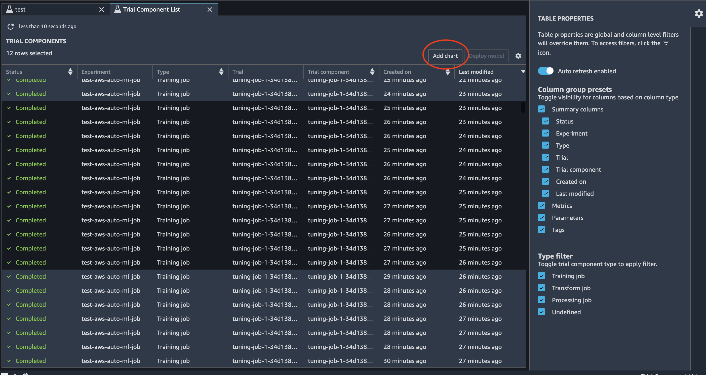

### Deploy the best candidate

Once the Autopilot job is in the __Completed__ state, go to the experiment tab and order the trials by the _Objective_ column in descending order. The first trial will be the one with the highest accuracy (and will be marked with the _Best_ prefix).

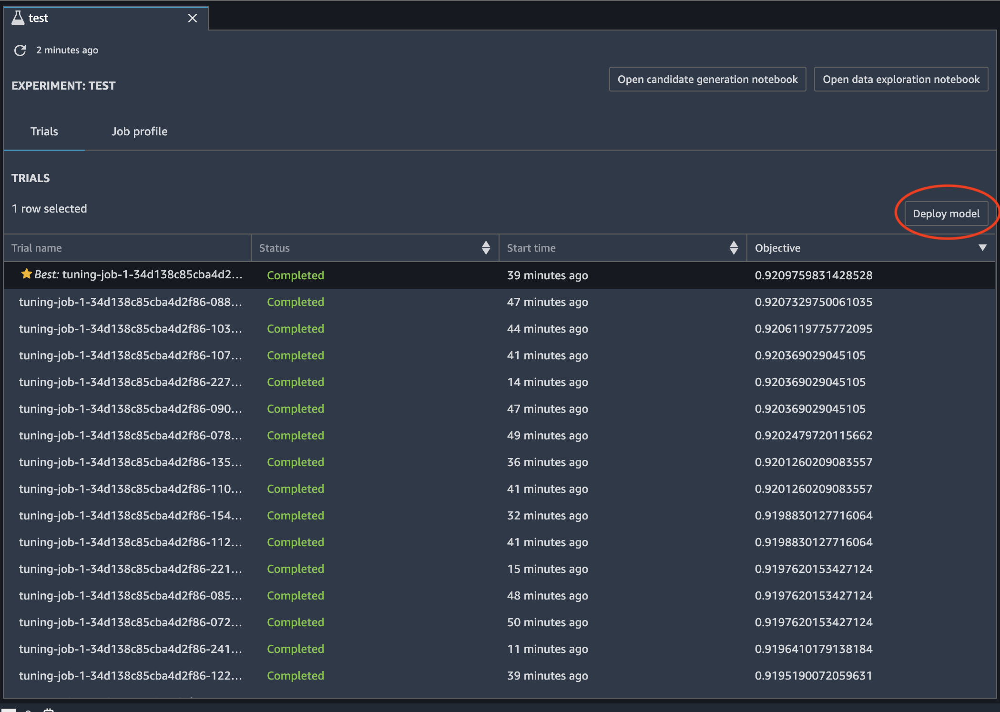

* Choose the best trial and click on the __Deploy model__ button.
* Fill the required fields for the real time model deployment:
  * Deployment name: _sm-autopilot-lab_
  * Instance type: _ml.m5.large_
  * Instance count: _1_
  
> The _Data capture_ section allows to capture the inference information in order to monitor the model behaviour. Leave this options uncheked at this time.

* Click on the __Deploy model__ button.

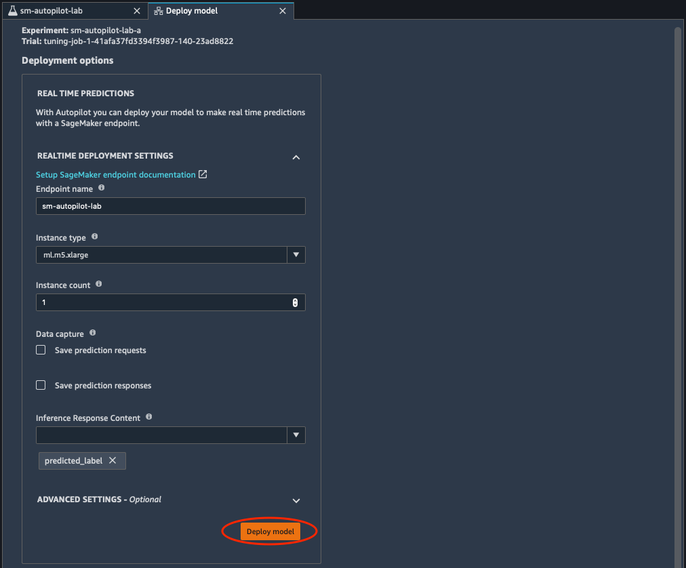

You can see the model deployment status on the _Endpoints_ menu on the left side of the window. When the model status is _InService_, the model will be deployed and ready to receive inference requests.

> Note with SageMaker you can either deploy Endpoints for real-time inference (like you do in this lab), or perform batch inference jobs for going through a set of records in files stored in S3. You can use one or the other depending on your specific use case.

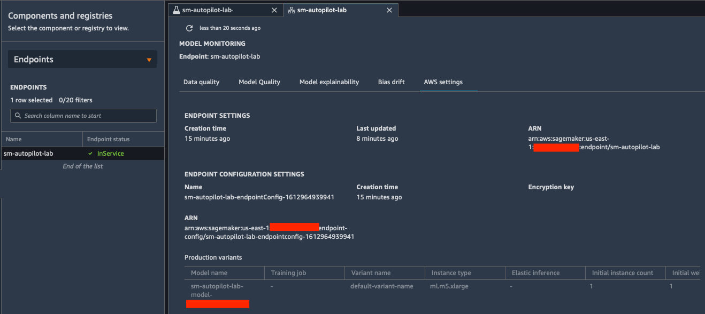

Congratulations! You have completed this lab.
