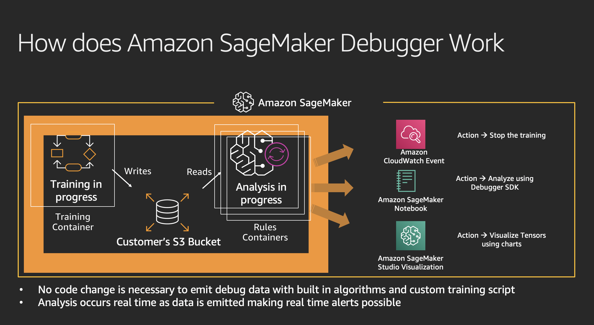
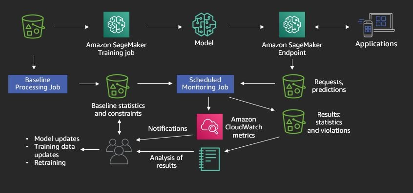

# Debugging and monitoring SageMaker models

[SageMaker Debugger](https://docs.aws.amazon.com/sagemaker/latest/dg/train-debugger.html) and [SageMaker Model Monitor](https://docs.aws.amazon.com/sagemaker/latest/dg/model-monitor.html) are new features that were launched un re:Invent 2019.

During the training stage of a machine learning model, you can leverage SageMaker Debugger to analyze the state of the training job (tensors) and detect errors such as [overfitting](https://en.wikipedia.org/wiki/Overfitting#Machine_learning), poor weight initialization or [vanishing gradients](https://en.wikipedia.org/wiki/Vanishing_gradient_problem). You can also define your own rules, if necessary.

Once the model is put into production, you can use SageMaker Model Monitor to detect negative scenarios such as the statistical properties of your input data deviating from the baseline data that the model was trained on, which can cause accuracy loss. By detecting these occurrences in advance, you can take corrective action, such as retraining your model, sooner.

In this lab you will train a model using the XGBoost algorithm that will classify a given network traffic flow and detect whether it is benign or malicious.

