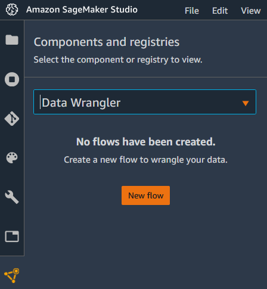
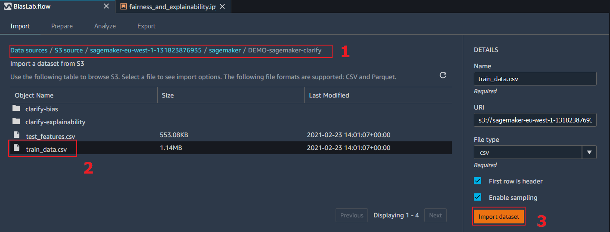
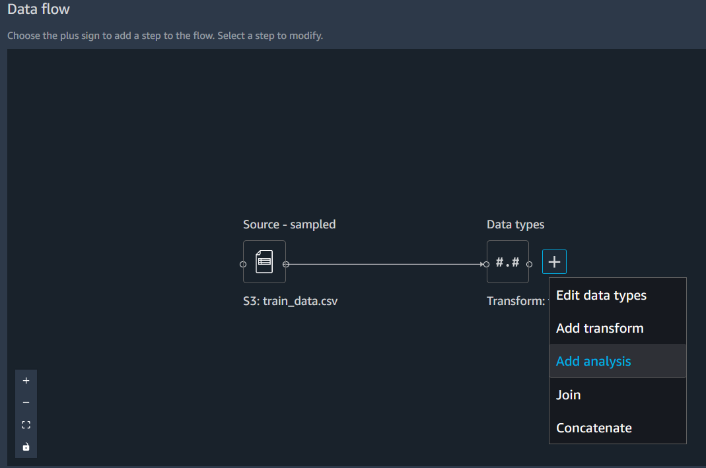
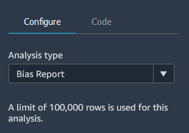
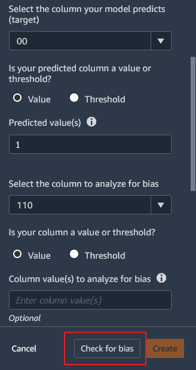
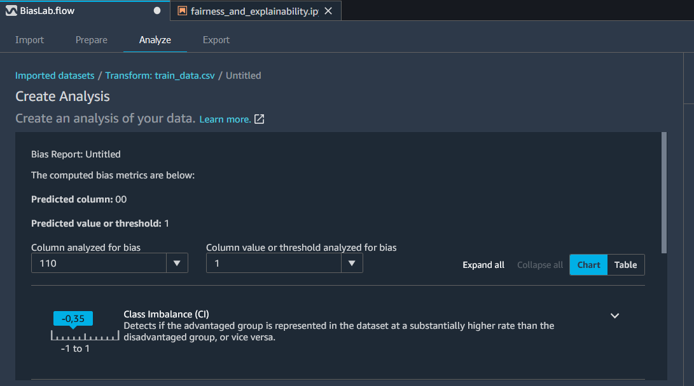

# Amazon SageMaker Fairness and Explainability laboratory

In this lab, you will use **SageMaker Clarify** feature to understand the biases in your data during the pre and post training phases with **Amazon SageMaker Studio**.

There are two main tasks to be performed on this lab:

1. Creating a new **Amazon SageMaker Studio** profile
    >*Note: If you already have an Studio profile in your account skip the onboarding step below.*
    * Onboard to Amazon SageMaker Studio with the QuickStart
    * Open Studio

2. Running the sample Jupyter Notebook **Fairness and explainability**:
    * Download the notebook and the dataset
    * Train an XGBoost models
    * Run bias detection and explainability analysis

3. Detect bias during data exploration

-----------------

## **Creating a new Amazon SageMaker Studio profile**

First, onboard to SageMaker Studio using the Quick start:
* Open the AWS Console for your account.
* Look for Amazon SageMaker and click on it.
* Choose *Amazon SageMaker Studio* at the top left of the page.


* On the Amazon SageMaker Studio Control Panel, under Get started, choose Quick start.
    * For "User name", keep the default name or create a new name. The name can be up to 63 characters. Valid characters: A-Z, a-z, 0-9, and - (hyphen).
    * For Execution role, choose "Create a new role", the Create an IAM role dialog opens. For S3 buckets you, choose "Any S3 bucket".
    * Choose "Create role". Amazon SageMaker creates a new IAM role with the AmazonSageMakerFullAccess policy attached.
    * Choose "Submit".
* On the Amazon SageMaker Studio Control Panel, under Studio Summary, wait for "Status" to change to "Ready".


* When Status is Ready, the user name that you specified is enabled and chosen. The Add user and Delete user buttons, and the Open Studio link are also enabled.
* Choose "Open Studio". The Amazon SageMaker Studio loading page displays. When Studio opens you can start using it (this can take a few mins the first time).

    > Now that you've onboarded to Amazon SageMaker Studio, in the future you can directly use the following steps to access Studio:
    > * Open the Amazon SageMaker console.
    > * Choose "Amazon SageMaker Studio" at the top left of the page.
    > * On the Amazon SageMaker Studio Control Panel, choose your user name and then choose "Open Studio".


## **Running the Fairness and Explainability notebook**

Now that your SageMaker Studio is open, you will get the notebook that we will be using and follow the steps on it:
* If not open already, create a new Studio Launcher tab by going to "File"->"New Launcher".


* Click on "Image Terminal" to open a new terminal tab.
* Copy-paste the following command in the terminal and hit enter. This will copy the notebook to your Studio local environment.
    ``` javascript
    wget https://github.com/rodzanto/ml-workshop/raw/master/machine-learning/sagemaker-explainability/fairness_and_explainability.ipynb
    ```

* In the left menu go to the "File Browser" (folder icon at the top-left).
* Double click the notebook file called *"fairness_and_explainability.ipynb"*. The notebook will open on a new tab.
* In the select kernel pop-up, select "Python (Data Science)".
* Now **read** and follow the cells in the notebook one by one.
    > If you are new to Jupyter notebooks, you can run the notebook document step-by-step (one cell a time) by pressing "shift" + "enter". Note:
    > * While a cell is running it will show an asterix "*" next to it
    > * When the cell execution completes it will show the execution number

The notebook will guide you through the process for performing the following tasks:
* Download the public Adult dataset, with demographic information.
* Explore and encode the data.
* Train an XGBoost model.
* Generate bias analysis for pre-training and post-training with SageMaker Clarify.
* Generate the predictions explainability report with SageMaker Clarify

## **Detecting bias during data exploration with SageMaker Data Wrangler**
The example Notebook showed us how to detect bias in the pre-training and post-training steps, now we will see how the data exploratory graphical environment of SageMaker Data Wrangler can be directly used to detect the bias in this early step in a wizard-driven approach instead of using API calls.

* Create a new flow in Data Wrangler, under Components and registries menu option



* The Data Wrangler will take a couple of minutes before is initialized. Once it is ready, Click on *Amazon S3* to import the training dataset. The dataset processed in the Jupyter Notebook is called *train_data.csv*. You have to browse to *sagemaker[your_own_suffix]*-->*sagemaker*-->*DEMO-sagemaker-clarify* to locate it. Select it and click on *Import dataset*



* You are redirected to the Data flow. Click on the *+* sign in the *Transform* box and select *Add analysis*



* Select the *Bias Report* Analysis type in the configuration section on the right. Select *00* as the target column (corresponding to the target dataset feature), *1* as the predicted value and *110* as the column to analyze for bias (corresponding to the *Sex* feature). You can leave the rest of fields in their default values and click on *Check for bias* button.





* Notice that the bias analysis is now available in this early step for the bias metrics not related with training.



Congratulations! You have completed this lab.
