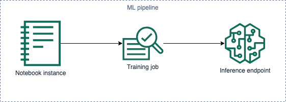

# SageMaker introductory workshop

In this introductory workshop you will get to know SageMaker and learn to do the following:

* Create a notebook instance.
* Play around with sample Jupyter notebooks and the SageMaker SDK.
* Explore data sets.
* Create training jobs.
* Deploy your models into hosted endpoints.
* Bring your custom algorithms.

