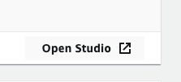

# Amazon SageMaker built-in algorithms and optimization laboratory

In this lab, you will get to work with **Amazon SageMaker** built-in algorithms, compare its performance vs the open-source versions, and performing inferences through models hosted in **AWS Lambda** for cost savings.

You will go through the following steps in summary:
1. Creating a new **Amazon SageMaker Studio** profile, or alternatively a traditional **Amazon SageMaker** notebook instance.
    >*Note 1: If you already have an Studio profile in your account skip the onboarding step below.*

    >*Note 2: You can also work on this laboratory with a traditional notebook instance (not Studio) in SageMaker. For information on how to create one follow the documentation [here](https://docs.aws.amazon.com/sagemaker/latest/dg/howitworks-create-ws.html).*
    * Onboard to Amazon SageMaker Studio with the QuickStart
    * Open Studio
2. Working with **Amazon SageMaker** built-in algorithms
    * Creating or downloading the notebooks
    * Exploring and working with the notebooks
        * Preparing data
        * Training with built-in and open source algorithms
        * Comparing the performance of both algorithms
3. Hosting trained models with **AWS Lambda** and performing inferences

<br>
<div align="center">
    
</div>

-----------------

## **Creating a new Amazon SageMaker Studio profile**

First, onboard to SageMaker Studio using the Quick start:
* Open the AWS Console for your account.
* Look for Amazon SageMaker and click on it.
* Choose *Amazon SageMaker Studio* at the top left of the page.

<div align="center"></div>

* On the Amazon SageMaker Studio Control Panel, under Get started, choose Quick start.
    * For "User name", keep the default name or create a new name. The name can be up to 63 characters. Valid characters: A-Z, a-z, 0-9, and - (hyphen).
    * For Execution role, choose "Create a new role", the Create an IAM role dialog opens. For S3 buckets you can choose "None".
    * Choose "Create role". Amazon SageMaker creates a new IAM role with the AmazonSageMakerFullAccess policy attached.
    * Choose "Submit".
* On the Amazon SageMaker Studio Control Panel, under Studio Summary, wait for "Status" to change to "Ready".

<div align="center"></div>

* When Status is Ready, the user name that you specified is enabled and chosen. The Add user and Delete user buttons, and the Open Studio link are also enabled.
* Choose "Open Studio". The Amazon SageMaker Studio loading page displays. When Studio opens you can start using it (this can take a few mins the first time).

    > Now that you've onboarded to Amazon SageMaker Studio, in the future you can directly use the following steps to access Studio:
    > * Open the Amazon SageMaker console.
    > * Choose "Amazon SageMaker Studio" at the top left of the page.
    > * On the Amazon SageMaker Studio Control Panel, choose your user name and then choose "Open Studio".

<div align="center"></div>

## **Working with Amazon SageMaker built-in algorithms**

**Amazon SageMaker** provides several built-in machine learning algorithms that you can use for a variety of problem types. For information on the built-in algorithms check the documentation [here](https://docs.aws.amazon.com/sagemaker/latest/dg/algos.html).

For this lab we will use a Jupyter notebook for guiding us through the process, and the XGBoost algorithm. Open a new terminal in your instance following options 1 or 2 below:

1. If using SageMaker Studio:
    * If not open already, create a new Studio Launcher tab by going to "File"->"New Launcher".

    <div align="center"></div>

    * Click on "Image Terminal" to open a new terminal tab.

    * Copy-paste the following command in the terminal and hit enter. This will copy the notebook to your Studio local environment.
        ``` javascript
        wget https://github.com/rodzanto/ml-workshop/raw/toro/machine-learning/sagemaker-optimization-1/sagemaker_optimization_xgboost.ipynb
        ```

    <div align="center"></div>

    * In the left menu go to the "File Browser" (folder icon at the top-left).
    * Double click the notebook file called *"sagemaker_optimization_xgboost.ipynb"*. The notebook will open on a new tab.
    * In the select kernel pop-up, select "Python (Data Science)".

    <div align="center"></div>

2. If using a traditional SageMaker notebook instance:
    * Open Jupyter and go to "New"->"Terminal"

        <div align="center"></div>

    * Copy-paste the following code to the terminal. This will copy the notebook to your instance environment:
        ``` javascript
        cd SageMaker

        wget https://github.com/rodzanto/ml-workshop/raw/toro/machine-learning/sagemaker-optimization-1/sagemaker_optimization_xgboost.ipynb
        ```

* Now **read** and follow the cells in the notebook one by one.
    > If you are new to Jupyter notebooks, you can run the notebook document step-by-step (one cell a time) by pressing "shift" + "enter". Note:
    > * While a cell is running it will show an asterix "*" next to it
    > * When the cell execution completes it will show the execution number

The notebook will guide you through the process for performing the following tasks:
* Downloading a public dataset
* Preparing the data for training in SageMaker
* Training with an open source version of XGBoost
* Training with SageMaker built-in XGBoost
* Comparing performance of both approaches

COMPLETE HERE!!!!!!!!!!!


## **Hosting trained models with AWS Lambda and performing inferences**

Amazon SageMaker allows you to either deploy your trained model to Endpoints for making inferences in real-time, or directly performing batch inferences for lists of records stored in S3. In this case we will follow a third approach in order to save costs for our model hosting, as we will host our trained model artifacts using **AWS Lambda** directly, for making inferences dynamically to it.

In order to do this follow these steps:
* Go to the AWS Console and look for "AWS Lambda"
* In the AWS Lambda console choose...

COMPLETE HERE!!!!!!!!!!!


Congratulations! You have completed this lab.
